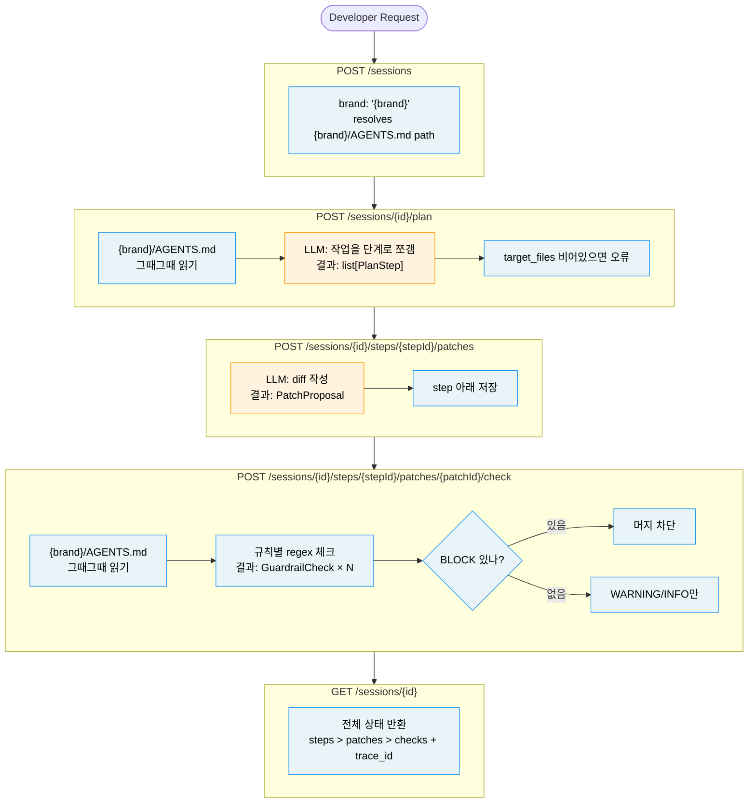

# Assignment Execution Protocol
# Agentic IDE IC1 Backend Engineer — Take-Home Playbook

> **How to use**: Give me this file + the assignment file at the start of a session.
> I will execute the phases below in order, using worktrees and parallel agents where specified.
> Target: 90%+ pass-rate output within the stated time budget.

---

## JD Signal Map — Read Before Any Code

Every implementation choice below maps to a JD keyword. If a choice is not on this map, it is P2.

| JD Keyword | What to show in code | Where it lands |
|---|---|---|
| `Git worktrees` | Two worktrees, parallel branches, explicit merge step | Phase 3 setup, commit history |
| `multi-agent` | Agent A (routes) + Agent B (guardrails) on separate worktrees | Phase 3 prompt framing |
| `AGENTS.md / Engineering Manifesto` | File loaded just-in-time in every LLM call; brand-specific override path described | `src/llm.py`, README §Architecture |
| `guardrails — safe to deploy` | `GuardrailCheck(ruleId, severity, result, reason)` — BLOCK stops merge | `src/guardrails.py`, README §Domain Model |
| `multi-brand (efood/glovo/talabat)` | `brand` field on Session; guardrail loader parametrized by brand | Schema, guardrail signature |
| `context integration` | AGENTS.md injected as system-prompt context, not hardcoded strings | `src/llm.py` system prompt |
| `OTEL / OAM / tracing` | `trace_id` on Session; P2 note for OAM export | Schema + README §If More Time |
| `deterministic boundary` | Regex-first guardrails; LLM only for plan/patch generation | README §Architecture diagram |
| `developer productivity / friction` | README §Problem opens with the manual workflow this replaces | README §1 Problem |
| `customizing cutting-edge agentic IDE` | "This is not a Cursor clone — it is the DH-aware integration layer above Cursor" | README §1 first line |
| `measurement / KPI` | `GuardrailCheck` output feeds PR/engineer and Human/AI code ratio dashboards | README §If More Time |

**Mandatory before submitting**: every row above must map to ≥1 line of code or README text.

---

## Design Principles — Apply Before Writing Any Schema or Route

These five principles gate every implementation decision. If a choice conflicts with one, stop and reconsider.

### 1. SRP — Single Responsibility per Endpoint

Each endpoint = one state transition = one responsibility.

| Endpoint | Responsibility | What it must NOT do |
|---|---|---|
| `POST /sessions` | Create session entity | Generate plan, touch LLM |
| `POST /sessions/{id}/plan` | Decompose description → `[PlanStep]` with `patches: []` | Generate diffs, run guardrails |
| `POST /sessions/{id}/steps/{step_id}/patches` | Generate diff for one PlanStep → `PatchProposal` with `checks: []` | Run guardrails, modify other steps |
| `POST /sessions/{id}/steps/{step_id}/patches/{patch_id}/check` | Run guardrails → `[GuardrailCheck]` | Generate new diffs, re-plan |
| `GET /sessions/{id}` | Return accumulated state | Trigger any computation |

**Smell check**: if a route calls both `generate()` and `check_patch()`, it violates SRP.

**Schema SRP corollary**: domain models (storage/response) and LLM input schemas are different things.
- Domain model: `PlanStep(id, description, target_files, patches=[])` — full state with children
- LLM input schema: `PlanStepInput(description, target_files)` — only what the LLM generates
- Never pass a domain model schema to the LLM if it contains nested children (id, created_at, child lists).
  The LLM will fill them in, breaking the SRP of every downstream endpoint.

---

### 2. Deterministic Boundary

The LLM is always sandwiched between deterministic code. Non-determinism is quarantined.

```
[deterministic in]  →  [LLM]  →  [deterministic out]
  schema validation     proposes    schema validation
  AGENTS.md load        only        guardrail regex
  brand resolution               Pydantic parsing
```

Rules:
- `src/guardrails.py` contains **zero** LLM calls. Regex only.
- `src/llm.py` contains **zero** business logic. It is a transport layer.
- LLM output is always parsed through Pydantic before it touches application state.
- Use `tool_use` + `tool_choice={"type":"tool","name":"output"}` — never free-text JSON parsing.

---

### 3. YAGNI — You Aren't Gonna Need It

Build exactly what the spec asks. Nothing more.

| Temptation | Decision |
|---|---|
| SQLite / Postgres | In-memory dict. Persistence is P2 — document the swap path. |
| Auth / API keys | Not in spec. Padding scope is a red flag for evaluators. |
| LLM-as-judge for guardrails | Regex covers R1–R5 exactly. LLM-as-judge is P2. |
| Retry loop / Evaluator-Optimizer | P2. Document it in README §If More Time. |
| Multi-brand AGENTS.md routing | `brand` parameter in signature. Second brand file is P2. |
| Caching | Not needed within a 90-min session lifetime. |

If it is not in the spec and not a JD signal, it is P2 — mention in README, do not implement.

**YAGNI applies to response shape too — Response Schema = Workflow Signal.**

The shape of a response communicates what the endpoint did. Empty child collections in a response are not "free" — they send a false signal.

```
# Wrong: POST /plan returns this
{"id": "...", "description": "...", "target_files": [...], "patches": []}
#                                                           ^^^^^^^^^^
#                                              implies patches are part of planning

# Right: POST /plan returns this
{"id": "...", "description": "...", "target_files": [...]}
# shape says: "I produced a plan step. patches are someone else's job."
```

Rule: **each endpoint's response schema contains only the fields that endpoint created.**
Use a dedicated response model (e.g. `PlanStepOut`, `PatchProposalOut`) without child lists — do not reuse the full domain model as the response type.

```python
# models.py — response schemas (one per endpoint that creates a new entity)
class PlanStepOut(BaseModel):
    id: UUID
    description: str
    target_files: list[str]
    # no patches — POST /plan does not create patches

class PatchProposalOut(BaseModel):
    id: UUID
    planStepId: UUID
    diff: str
    # no checks — POST /patches does not run guardrails
```

The full domain model (`PlanStep` with `patches`, `PatchProposal` with `checks`) is only used in `GET /sessions/{id}` — the accumulated state view.

---

### 4. Workflow-first Design

Design the workflow (sequence of state transitions) before designing schemas or routes.

**Step 1 — Draw the workflow as a state machine first:**
```
∅ → Session(steps=[]) → Session(steps=[PlanStep(patches=[])]) → Session(steps=[PlanStep(patches=[PatchProposal(checks=[])])]) → Session(steps=[...(checks=[GuardrailCheck...])])
```

**Step 2 — Each arrow = one endpoint.**
Each endpoint advances state by exactly one step. No endpoint skips a step or does two steps at once.

**Step 3 — Schema flows from workflow, not from database convenience.**
Ask: "what is the minimal input the LLM needs to do its job?" → that is the LLM input schema.
Ask: "what is the full state a reviewing engineer needs?" → that is the domain model.

---

### 5. Explainability

Every AI decision must be traceable by a human reviewer.

| Layer | Explainability mechanism |
|---|---|
| Plan generation | `PlanStep.description` is human-readable; `target_files` is explicit |
| Patch generation | `PatchProposal.diff` is a standard unified diff — reviewable in any diff tool |
| Guardrail result | `GuardrailCheck.ruleId` + `reason` — cites the specific AGENTS.md rule |
| Session audit | `Session.trace_id` — future OTEL/OAM hook |
| AI vs human work | README §AI Leverage table — explicit, honest accounting |

**Rule**: No GuardrailCheck result without a `reason` that names the specific rule (`per AGENTS.md R4`).
A `result: "fail"` with `reason: "error"` is worse than useless — it is unactionable.

---

## Meta-Principles (from Anthropic engineering blog + agent-architecture.md)

- **Deterministic sandwich**: Every LLM call sits between deterministic input validation and deterministic output verification. The LLM proposes; the code decides.
- **Workflow backbone + one agent loop**: LLM loop only where genuinely non-deterministic. Guardrails are always deterministic.
- **Just-in-time context**: Load AGENTS.md at call time — never pre-dump into module-level startup.
- **Single agent > multi-agent for the coding loop**: Use parallel worktrees for *independent implementation tracks*, not for agents collaborating on the same task.
- **README is the deliverable**: Code is proof it works. The README demonstrates you think like a system designer.
- **DH framing**: This service is a "DH-aware integration layer" — it augments Cursor/Claude Code with brand context and guardrails. It is not a replacement IDE.

## Slash Command Contract — `/assignment`

The project command lives in both `.claude/commands/assignment.md` and
`case-01-session-backend/.claude/commands/assignment.md`. Keep them in sync.

Pattern borrowed from Anthropic's `anthropics/claude-code` project commands:

- Use command frontmatter (`description`, `allowed-tools`) so the command advertises its purpose and narrows tool use.
- Inject live context at invocation time (`git status`, assignment text, protocol, AGENTS.md) instead of relying on stale memory.
- Treat `$ARGUMENTS` as extra user input, not as a replacement for the assignment or protocol.
- Start with a todo list and update it as phases complete.
- Never invent requirements. If the assignment is ambiguous, document the assumption rather than expanding scope.
- Be conservative with automation: do not push, open PRs, or post external comments unless the user explicitly asks.
- End every `/assignment` run with files changed, verification run, and remaining checks.

If a command behavior conflicts with this protocol, the protocol wins.

---

## SPEC Writing Style Guide

SPEC.md는 사용자가 직접 읽는 설계 문서다.
Phase 0~G를 진행하면서 SPEC.md에 내용을 채울 때 아래 규칙을 따른다.

### 언어 규칙

- 한국어로 작성한다.
- em dash (—) 절대 사용 금지. 쉼표, 마침표, 줄바꿈으로 대체한다.
- 한자어 줄임말 사용 금지. 풀어서 쓴다.
  - 나쁜 예: "산출물", "역할", "비결정적 부분", "외부 통합"
  - 좋은 예: "만드는 것", "하는 일", "LLM이 만들어서 결과가 매번 다른 부분", "외부 서비스 연결"
- 약어는 처음 등장할 때 한 번 설명한다.

### 설명 방식

- 각 설계 결정은 "왜 이렇게 했냐면" 식으로 판단 근거를 풀어서 쓴다.
- 단순 목록 나열보다 연결된 문장으로 맥락을 설명한다.
- 좋은 예: "패치는 실제 코드에 적용하지 않고 후보 변경사항으로 저장만 한다. 왜 이렇게 했냐면, AI 워크플로우는 반복 수정 과정이기 때문이다."
- 나쁜 예: "패치: 후보, 미적용"

### 구조 규칙

- 데이터 모델 간 관계는 텍스트로 나타낸다. 예: `Session > PlanStep > PatchProposal > GuardrailCheck`
- 아키텍처 다이어그램은 Mermaid flowchart로 작성한다 (ASCII 아트 사용 금지).
  - ` ```mermaid ` 코드 블록 안에 작성한다.
  - LLM이 하는 부분(주황색)과 서비스가 직접 하는 부분(파란색)을 색으로 구분한다.
- 각 설계 결정은 "결정 N" 형식으로 번호를 매겨서 나중에 참조할 수 있게 한다.

### SPEC 완성 체크리스트

- [ ] em dash (—) 없음
- [ ] 한자어 줄임말 없음
- [ ] 각 설계 결정에 "왜 이렇게 했냐면" 설명 있음
- [ ] 데이터 모델 관계 표시 있음
- [ ] Mermaid 아키텍처 다이어그램 있음
- [ ] 엔드포인트 표 있음 (번호, URL, 하는 일)

---

## Phase 0 — Decompose (0:00 – 0:05)

**Who runs this**: Me (Claude Code), immediately on receiving the assignment.

### 0.1 XY-30S Decomposition (4 bullets, 30 seconds)

```
- WHO uses this?           → developer requesting an AI-assisted code change
- WHAT friction removed?   → manual diff review + rule compliance check against AGENTS.md
- NON-DETERMINISTIC parts? → plan decomposition, patch generation (LLM); rule checking (regex)
- EXTERNAL integrations?   → Anthropic API, AGENTS.md file, brand config
```

### 0.2 Risk Inventory

| Risk | Mitigation |
|------|-----------|
| LLM latency in tests | `ANTHROPIC_API_KEY` missing → mock mode; real call behind flag |
| Storage underspecified | In-memory dict; documented swap path to Postgres |
| Rule ambiguity in AGENTS.md | Regex-first; LLM-as-judge only if regex is insufficient |
| Multi-brand complexity | `brand` field drives AGENTS.md path; single override dict per brand |
| Time overrun | P0/P1/P2 locked before first line of code |

### 0.3 P0 / P1 / P2 Cut List

| Tier | Scope | Time |
|------|-------|------|
| **P0** | All 5 endpoints + 2 deterministic guardrails (R4, R5 minimum) + 1 pytest green | 0–75 min |
| **P1** | Real Anthropic SDK call with structured JSON output; `trace_id` on every response; brand-parametrized guardrail loader | 75–85 min |
| **P2** | OTEL export to OAM; SQLite persistence; multi-brand AGENTS.md override; auth; SKILL.md Skills pattern | README mention only |

---

## Phase 1 — README Skeleton + Domain Model (0:05 – 0:20)

### 1.1 README.md — Write the 5 sections in English, all blanks filled with placeholders

```markdown
# Session Backend — Agentic IDE Integration Layer

> This service is the DH-aware integration layer that sits above Cursor/Claude Code:
> it injects brand context (AGENTS.md), proposes code patches via LLM, and enforces
> guardrails before any generated diff can be merged.
> The LLM proposes; deterministic checks decide.

## 1. Problem & Approach

**What this replaces**: a developer manually reviewing LLM-generated diffs against
their brand's Engineering Manifesto (AGENTS.md) before merging.

**Architecture**: deterministic sandwich —
- deterministic input (AGENTS.md loaded just-in-time, brand resolved from session)
- LLM call (plan decomposition or patch generation, schema-constrained output)
- deterministic output (guardrail regex checks, severity-gated merge decision)

**Assumptions** (5+):
1. In-memory storage is sufficient for a session-scoped prototype; persistence is P2.
2. AGENTS.md lives at the repo root and is the authoritative rule source.
3. Severity BLOCK = merge blocked; WARN = visible to developer but not blocking.
4. LLM output is always validated against the Pydantic schema before storage.
5. Each brand (efood/glovo/talabat) can have its own AGENTS.md path; currently efood only.
6. `trace_id` is generated per-session for future OTEL export.

**Ambiguities I noticed**:
1. Should WARN rules accumulate across patches and block after N warnings?
2. Is the LLM allowed to propose changes to AGENTS.md itself?
3. Who owns rule addition — platform team or brand team?

## 2. Domain Model

- `Session` — top-level entity; carries `brand`, `trace_id`, and all child lists
- `PlanStep` — one proposed change (description + target_files)
- `PatchProposal` — unified diff string for one PlanStep
- `GuardrailCheck` — one rule result: `ruleId`, `severity`, `result`, `reason`

```
Session 1—* PlanStep 1—* PatchProposal 1—* GuardrailCheck
```

Severity ladder: `BLOCK` (security/brand violation) > `WARN` (style) > `INFO` (suggestion).
A patch with any `BLOCK` check cannot be merged. This feeds the Human/AI code ratio KPI
by flagging which AI-generated diffs required human intervention.

## 3. AI Leverage

| Part | Done by | Verification |
|------|---------|--------------|
| Domain models | Hand | Type-checked by Pydantic + mypy |
| FastAPI routes | AI (Claude Code, worktree feat/routes) | Hand-reviewed diff |
| Guardrail regex rules | AI (Claude Code, worktree feat/guardrails) | Pytest: R2/R4/R5 BLOCK cases |
| LLM prompt design | Hand | Manual smoke test with real API key |
| README | Hand | — |

Every AI-generated file went through: `ruff check` → `pytest` → manual diff scan.
No AI output was committed without a test covering the specific behavior.

"The LLM only performs extraction and proposal generation.
Merging, validation, and guardrail evaluation are deterministic."

## 4. Trade-offs & Decisions

| Decision | Rationale | Reconsider if |
|----------|-----------|---------------|
| In-memory storage | Removes DB setup from the critical path; session lifetime = single workflow | Sessions must survive server restart |
| Regex-first guardrails (not LLM-as-judge) | Deterministic, fast, testable; regex covers R1–R5 exactly | Rules become too nuanced for regex (e.g. "detect hardcoded secret") |
| Single-brand (efood) | Spec asks for one brand; multi-brand is a path, not a feature | Second brand onboards |
| No auth | Spec does not specify auth; adding it would pad scope, not signal | Service goes to staging |
| Direct Anthropic SDK (no LangChain) | Framework would obscure the prompt/response contract, making guardrails harder to test | Team standardizes on a shared LLM gateway |
| `trace_id` on every entity | Free — uuid4 at creation time; enables OTEL export without schema change | OAM integration is scoped |

## 5. If More Time

- **OTEL export** → push `trace_id` spans to DH OAM (Observability & Monitoring); ties into PR/engineer KPI dashboard
- **Multi-brand AGENTS.md override** → parametrize loader by `brand`; each brand maintains its own manifesto
- **SKILL.md Skills pattern** (Anthropic open standard) → per-brand capability packages loadable just-in-time
- **SQLite persistence** → swap in-memory dict for SQLite; no schema change required (Pydantic models already serialize cleanly)
- **LLM-as-judge for style rules** → R3 (docstrings) is hard to catch with regex; second-pass LLM eval for WARN-tier rules
- **Evaluator-Optimizer loop** → let LLM re-propose patch after BLOCK guardrail fails, up to N retries

## How to Run

```bash
uv sync
cp .env.example .env     # set ANTHROPIC_API_KEY (or leave blank for mock mode)
uv run pytest            # all tests green
uv run uvicorn src.main:app --reload
# → http://localhost:8000/docs
```

Full workflow:
```bash
# 1. create session
SESSION=$(curl -s -X POST localhost:8000/sessions \
  -H "Content-Type: application/json" \
  -d '{"title":"add discount","description":"add pricing/discount.py","brand":"efood"}' \
  | python3 -c "import sys,json; print(json.load(sys.stdin)['id'])")

# 2. plan
curl -s -X POST localhost:8000/sessions/$SESSION/plan | python3 -m json.tool

# 3. patch (use planStepId from step 2)
PATCH=$(curl -s -X POST localhost:8000/sessions/$SESSION/patches \
  -H "Content-Type: application/json" \
  -d '{"planStepId":"<id>"}' | python3 -c "import sys,json; print(json.load(sys.stdin)['id'])")

# 4. check — expect R4 and R5 to flag BLOCK
curl -s -X POST localhost:8000/sessions/$SESSION/patches/$PATCH/check | python3 -m json.tool
```
```

### 1.2 Pydantic Schemas — data shape only, zero logic

Three kinds of models. Do not confuse them.

| Kind | Purpose | Rule |
|---|---|---|
| **LLM input schema** | What we ask the LLM to generate | Only fields the LLM creates. No id, no timestamps, no child lists. |
| **Response schema (Out)** | What each endpoint returns to the caller | Only fields that endpoint created. No child lists belonging to later endpoints. |
| **Domain model** | Storage + `GET /sessions/{id}` full state | Nested children: steps → patches → checks. Never use as LLM input or single-step response. |

**Never pass a domain model schema to the LLM.** Child lists (`patches`, `checks`) will be filled in by the LLM, silently collapsing separate endpoints into one — violating SRP and Workflow-first.

**Never return a domain model directly from a mutating endpoint.** Returning `PlanStep` (which includes `patches: []`) from `POST /plan` falsely implies the plan step owns patching — a structural lie in the API contract.

Files: `src/models.py` + `src/schemas.py`

```python
# ── src/models.py — 도메인 모델만 ────────────────────────────────────────────
from uuid import UUID
from datetime import datetime
from typing import Literal
from pydantic import BaseModel, ConfigDict, Field

Brand = Literal["efood", "glovo", "talabat"]
Severity = Literal["BLOCK", "WARN", "INFO"]
CheckResult = Literal["pass", "fail"]

class GuardrailCheck(BaseModel):
    model_config = ConfigDict(from_attributes=True)
    ruleId: str
    severity: Severity
    result: CheckResult
    reason: str                     # must cite specific rule: "per AGENTS.md R4"

class PatchProposal(BaseModel):
    model_config = ConfigDict(from_attributes=True)
    id: UUID
    step_id: UUID
    brand: Brand
    diff: str
    checks: list[GuardrailCheck] = Field(default_factory=list)
    created_at: datetime

class PlanStep(BaseModel):
    model_config = ConfigDict(from_attributes=True)
    id: UUID
    description: str
    target_files: list[str]
    patches: list[PatchProposal] = Field(default_factory=list)

class Session(BaseModel):
    model_config = ConfigDict(from_attributes=True)
    id: UUID
    title: str
    description: str
    brand: Brand
    trace_id: UUID                  # OTEL hook
    owner_id: str = ""
    steps: list[PlanStep] = Field(default_factory=list)
    created_at: datetime


# ── src/schemas.py — DTOs (요청/LLM/응답) ────────────────────────────────────
from src.models import Brand

class SessionCreate(BaseModel):    # request DTO
    title: str
    description: str
    brand: Brand

class PatchCreate(BaseModel):      # request DTO
    step_id: UUID

class PlanStepInput(BaseModel):    # LLM input DTO
    description: str
    target_files: list[str]

class PatchProposalInput(BaseModel):# LLM input DTO
    diff: str

class PlanStepOut(BaseModel):      # response DTO — no patches
    id: UUID
    description: str
    target_files: list[str]

class PatchProposalOut(BaseModel): # response DTO — no checks
    id: UUID
    step_id: UUID
    diff: str
    created_at: datetime
```

**Import rule**: `src/schemas.py`는 `src/models.py`에서 import 가능. 반대 방향(`src/models.py` → `src/schemas.py`)은 금지.

**Success gate**: `uv run python -c "from src.models import Session, PlanStep, PatchProposal, GuardrailCheck; from src.schemas import PlanStepInput, PatchProposalInput, PlanStepOut, PatchProposalOut"` exits 0.

**Design principle check**:
- `PlanStepInput` / `PatchProposalInput` exist and are separate from domain models (SRP) ✓
- `PlanStepOut` / `PatchProposalOut` exist and omit child lists (Response Shape = Workflow Signal) ✓
- `brand: Brand` — multi-brand (JD signal) ✓
- `trace_id` — OTEL hook (JD signal) ✓
- `reason: str` — explainability: cites AGENTS.md rule ✓

---

## Phase 2 — Architecture Diagram in README (0:20 – 0:25)

Add this to README §1 before writing any route. This diagram is what the evaluator reads in 30 seconds to assess system thinking.

Use Mermaid for the architecture diagram — it renders on GitHub and makes the deterministic vs LLM boundary visually clear.



파란 박스: 서비스가 직접 처리 (결과 예측 가능)
주황 박스: LLM이 처리 (결과가 매번 다를 수 있음)

**Opening sentence** (README §1에 그대로 넣기):
> "This service models an AI-assisted coding workflow. The LLM proposes candidate changes; deterministic checks decide merge readiness."

**Positioning sentence** (README intro 두 번째 줄):
> "It is not a Cursor clone. It is the DH-aware integration layer that injects brand context (AGENTS.md) and enforces Engineering Manifesto guardrails before any AI-generated patch can be merged."

---

## Phase 3 — Implementation (0:25 – 1:15)

### Worktree Setup — Explicit JD Signal

The worktree split is **not just an efficiency choice** — it demonstrates the JD requirement: "Git worktrees and modern development workflows." Name the branches so the git log tells the story.

```bash
# From repo root (main branch already has models.py)
git worktree add ../wt-routes -b feat/routes-llm-integration
git worktree add ../wt-guardrails -b feat/guardrails-deterministic
```

Both agents run concurrently. Each sees the same `src/models.py` (committed to main before Phase 3).

---

### Agent A Prompt — Routes + LLM Integration (worktree: wt-routes)

```
You are implementing the FastAPI routes for a DH Agentic IDE session backend.
Branch: feat/routes-llm-integration. Worktree: ../wt-routes.
src/models.py is already committed on main — do NOT modify it.

Positioning context (important for README alignment):
This service is the "DH-aware integration layer" above Cursor/Claude Code.
It injects AGENTS.md (the brand's Engineering Manifesto) as just-in-time context
into every LLM call — not as a pre-loaded module variable.

Files to create:
  src/llm.py    — LLM client wrapper
  src/routes.py — 5 FastAPI route handlers
  src/main.py   — app factory + router registration + /health

1. src/llm.py
   - Two functions: generate(prompt, brand, schema) -> dict  and  generate_list(prompt, brand, schema) -> list[dict]
   - Loads AGENTS.md for the brand just-in-time: Path(f"{brand}/AGENTS.md").read_text()
   - Uses tool_use for structured output — NEVER free-text JSON parsing:
       tools=[{"name":"output","description":"...","input_schema": schema.model_json_schema()}]
       tool_choice={"type":"tool","name":"output"}
       result = response.content[0].input   # already a dict, no json.loads needed
   - max_tokens=4096 minimum
   - generate_list wraps schema in: {"type":"object","properties":{"items":{"type":"array","items":schema.model_json_schema()}},"required":["items"]}
     and returns result["items"]
   - If ANTHROPIC_API_KEY not set: return deterministic mock (do not crash)
   - CRITICAL: routes call generate(prompt, brand, PlanStepInput) and generate(prompt, brand, PatchProposalInput)
     — NEVER generate(prompt, brand, PlanStep) or generate(prompt, brand, PatchProposal)
     — Domain models contain child lists; passing them to LLM violates SRP
   - Functions ≤ 30 lines. No print(). Use logging.

2. src/routes.py — all routes use sessions: dict[str, Session] from src/store.py

   Use three-tier schemas — NEVER return a domain model from a mutating endpoint:
   - LLM calls: generate(prompt, brand, PlanStepInput), generate(prompt, brand, PatchProposalInput)
   - POST /plan response_model=list[PlanStepOut] — return PlanStepOut per step (no patches field)
   - POST /patches response_model=PatchProposalOut — return PatchProposalOut (no checks field)
   - GET /sessions/{id} response_model=Session — only endpoint that returns full nested state

   POST /sessions
     body: {title, description, brand}
     → Session(title=..., description=..., brand=...)
     → store in dict, return session

   POST /sessions/{id}/plan
     → call generate_list(prompt, brand, PlanStepInput) → list[dict]
     → steps = [PlanStep(**s) for s in raw_steps]; attach to session.steps
     → return [PlanStepOut(id=s.id, description=s.description, target_files=s.target_files) for s in steps]

   POST /sessions/{id}/steps/{step_id}/patches
     step_id is a path param — no request body needed
     → call generate(prompt, brand, PatchProposalInput) → dict
     → patch = PatchProposal(**raw, planStepId=step.id); attach to step.patches
     → return PatchProposalOut(id=patch.id, planStepId=patch.planStepId, diff=patch.diff, created_at=patch.created_at)

   POST /sessions/{id}/steps/{step_id}/patches/{patch_id}/check
     → import check_patch from src.guardrails (stub: raise ImportError gracefully if missing)
     → attach results to patch.checks, return list[GuardrailCheck]

   GET /sessions/{id}
     → return full Session (all nested lists included)

3. src/store.py
   sessions: dict[str, Session] = {}

Constraints:
- All imports absolute (from src.models import ...)
- ruff check must pass
- No print() anywhere

Done when: uvicorn src.main:app starts and GET /health returns {"status": "ok"}.
```

---

### Agent B Prompt — Guardrails + Tests (worktree: wt-guardrails)

```
You are implementing the deterministic guardrail layer for a DH Agentic IDE session backend.
Branch: feat/guardrails-deterministic. Worktree: ../wt-guardrails.
src/models.py is already committed on main — do NOT modify it.

JD context:
The guardrail is what makes AI-generated code "safe to deploy."
It implements the Engineering Manifesto (AGENTS.md) as code-enforced policy.
Every rule must produce a GuardrailCheck with ruleId, severity, result, and reason.

File: src/guardrails.py

  def run_checks(diff: str, brand: Brand) -> list[GuardrailCheck]:
      """Evaluate a unified diff against the brand's AGENTS.md rules.
      Returns one GuardrailCheck per rule, regardless of pass/fail.
      """

MANDATORY — AGENTS.md must be the source of truth for severities:

  def _parse_severities(brand: Brand) -> dict[str, str]:
      """Read {brand}/AGENTS.md and parse rule severities from it.
      Fall back to hardcoded defaults only if the file is missing.
      """
      try:
          text = Path(f"{brand}/AGENTS.md").read_text()
      except FileNotFoundError:
          return {"R1": "WARN", "R2": "BLOCK", "R3": "WARN", "R4": "BLOCK", "R5": "BLOCK"}
      pattern = re.compile(r"-\s+(R\d+)\s+(WARN|BLOCK|INFO):")
      return {m.group(1): m.group(2) for m in pattern.finditer(text)}

  # run_checks calls _parse_severities(brand) FIRST, then passes sev.get("R1", ...) etc.
  # NEVER hardcode "WARN" or "BLOCK" as literals in the rule dispatch list itself.

Rules (regex-based, deterministic — no LLM calls in this file):

  R1 — Absolute imports only
    Pattern: line in diff starting with +, containing "from ." (relative import)
    Reason template: "Relative import detected: '{match}' — use absolute imports per AGENTS.md R1"

  R2 — No os.system or subprocess without review
    Pattern: + line containing "os.system(" or "subprocess."
    Reason template: "Unsafe shell call '{match}' — requires explicit security review per AGENTS.md R2"

  R3 — Public functions must have docstrings
    Pattern: + line matching `def [a-z][^_]` (public, non-dunder) not followed by a + line with """
    Reason: "Public function missing docstring per AGENTS.md R3"

  R4 — No print() — use efood.logging
    Pattern: + line containing "print("
    Reason template: "print() call detected — use efood.logging per AGENTS.md R4"

  R5 — External HTTP via efood.http_client only
    Pattern: + line containing "requests." (get/post/put/delete/patch)
    Reason template: "Direct requests.{method} call — use efood.http_client per AGENTS.md R5"

(Severities come from _parse_severities(brand), not hardcoded here.)
Return one GuardrailCheck per rule, always. If no violation found: result="pass".

File: tests/test_guardrails.py

  SAMPLE_PATCH (use this for multi-rule tests):
    +from .utils import calc
    +def apply_discount(order, pct):
    +    print(f"Discount applied: {pct}")
    +    requests.get(provider_url)

  test_r4_print_block: SAMPLE_PATCH → R4 result="fail", severity="BLOCK"
  test_r5_requests_block: SAMPLE_PATCH → R5 result="fail", severity="BLOCK"
  test_r1_relative_import_warn: SAMPLE_PATCH → R1 result="fail", severity="WARN"
  test_clean_patch_all_pass: clean patch (no violations) → all result="pass"
  test_r2_subprocess_block: patch with "subprocess.run(" → R2 result="fail", severity="BLOCK"
  test_agents_md_drives_severity: modify efood/AGENTS.md R1 from WARN→BLOCK, call
    run_checks("+from .x import y", "efood") → R1 severity must be "BLOCK" (proves file is read)
    Restore AGENTS.md after test.

Done when: uv run pytest tests/test_guardrails.py -v shows all tests passing.
```

---

### Merge + Integration (after both agents complete)

```bash
cd /path/to/main-repo
git merge feat/routes-llm-integration
git merge feat/guardrails-deterministic

# Wire guardrail into /check route:
# src/routes.py: replace `return []` stub with:
#   from src.guardrails import check_patch
#   results = check_patch(patch.diff, session.brand)
```

Verify integration:
```bash
uv run pytest                        # all tests green
uv run uvicorn src.main:app --reload # server starts
```

---

## Phase 4 — E2E Validation (1:15 – 1:25)

Unit tests verify code correctness. This phase verifies **feature correctness** — the evaluator's actual test.

```bash
# 1. create efood session
SESSION=$(curl -s -X POST localhost:8000/sessions \
  -H "Content-Type: application/json" \
  -d '{"title":"discount module","description":"add pricing/discount.py with apply_discount","brand":"efood"}' \
  | python3 -c "import sys,json; d=json.load(sys.stdin); print(d['id'])")

echo "Session: $SESSION"

# 2. plan
STEP=$(curl -s -X POST localhost:8000/sessions/$SESSION/plan \
  | python3 -c "import sys,json; d=json.load(sys.stdin); print(d[0]['id'])")

echo "Step: $STEP"

# 3. patch
PATCH=$(curl -s -X POST localhost:8000/sessions/$SESSION/steps/$STEP/patches \
  | python3 -c "import sys,json; print(json.load(sys.stdin)['id'])")

echo "Patch: $PATCH"

# 4. check — MUST see R4 and R5 as BLOCK
curl -s -X POST localhost:8000/sessions/$SESSION/steps/$STEP/patches/$PATCH/check \
  | python3 -m json.tool

# 5. full state
curl -s localhost:8000/sessions/$SESSION | python3 -m json.tool
```

**Pass criteria**:
- R4 (`print`) → `severity: "BLOCK"`, `result: "fail"` ✓
- R5 (`requests`) → `severity: "BLOCK"`, `result: "fail"` ✓
- `trace_id` present on Session ✓
- Full state returns nested steps → patches → checks ✓

---

## Phase 5 — README Finalize + JD Alignment (1:25 – 1:30)

Fill every blank in the skeleton. Then run the JD alignment check below.

### JD Alignment Check — Automated Gate (run every command; all must exit 0)

Each check is an executable assertion. A non-zero exit or empty output = FAIL; fix before submit.

```bash
# ── 1. AGENTS.md loaded just-in-time in llm.py ─────────────────────────────
grep -En "AGENTS\.md|read_agents|read_text" src/llm.py | grep -v "^\s*#"
# Must return ≥1 line. Empty → FAIL: llm.py does not read AGENTS.md.

# ── 2. AGENTS.md read in guardrails.py ──────────────────────────────────────
grep -En "AGENTS\.md|read_text|_parse_severities|_parse_rules" src/guardrails.py | grep -v "^\s*#"
# Must return ≥1 line. Empty → FAIL: guardrails reads no brand file.

# ── 3. brand is PASSED to guardrails from service layer ─────────────────────
grep -En "run_checks\(|check_patch\(" src/service.py | grep "brand"
# Must return ≥1 line. Empty → FAIL: brand not forwarded to guardrails.

# ── 4. No hardcoded severity literals in rule dispatch list ─────────────────
python3 - <<'EOF'
import ast, sys
src = open("src/guardrails.py").read()
tree = ast.parse(src)
# Find all string literals that are "WARN" or "BLOCK"
literals = [n for n in ast.walk(tree) if isinstance(n, ast.Constant) and n.value in {"WARN","BLOCK","INFO"}]
# They should appear only in fallback/default dicts, not in the dispatch list
# Heuristic: if >5 such literals exist outside of a dict, something is hardcoded
print(f"Severity literals found: {len(literals)} — review manually if >10")
EOF

# ── 5. LLM uses tool_use (no free-text JSON parsing) ───────────────────────
grep -En "tool_choice" src/llm.py | grep -v "^\s*#"
# Must return ≥1 line. Empty → FAIL: not using tool_use.

grep -En "json\.loads" src/llm.py | grep -v "^\s*#" | grep -v "test"
# Must return 0 lines. Any hit → FAIL: json.loads on raw LLM response.

# ── 6. max_tokens ≥ 4096 ────────────────────────────────────────────────────
python3 -c "
import re, sys
text = open('src/llm.py').read()
hits = re.findall(r'max_tokens\s*=\s*(\d+)', text)
bad = [h for h in hits if int(h) < 4096]
if bad: sys.exit(f'FAIL: max_tokens too low: {bad}')
print(f'max_tokens OK: {hits}')
"

# ── 7. response.content[0].input (not json.loads) ───────────────────────────
grep -En "response\.content\[0\]\.input|content\[0\]\.input" src/llm.py | grep -v "^\s*#"
# Must return ≥1 line. Empty → FAIL: not using structured output correctly.

# ── 8. trace_id on Session ───────────────────────────────────────────────────
grep -En "trace_id" src/models.py | grep -v "^\s*#"
# Must return ≥1 line. Empty → FAIL: no trace_id.

# ── 9. No print() in src/ ────────────────────────────────────────────────────
result=$(grep -rEn "^\s*print\s*\(" src/ | grep -v "test_")
if [ -n "$result" ]; then echo "FAIL: print() found:"; echo "$result"; exit 1; fi
echo "No print() — OK"

# ── 10. Git worktrees in log ─────────────────────────────────────────────────
git log --oneline --graph | head -20
# Visually verify feat/routes and feat/guardrails branch names appear.

# ── 11. POST /plan response has no patches field ─────────────────────────────
python3 -c "
import subprocess, json, sys
# Requires server running: uv run uvicorn src.main:app &
# If not running, skip and note manually.
print('Run manually if server is up:')
print('curl -s -X POST localhost:8000/sessions -H \"Content-Type: application/json\" -d \\'{}\\' | python3 -m json.tool')
"
```

**Passing criteria**: every command above exits 0. Items 10 and 11 are visual — note result explicitly.

### Design Principles Check (run before JD alignment)

| Principle | Verification |
|---|---|
| SRP — POST /plan response has no `patches` field | `curl .../plan \| python3 -c "import json,sys; d=json.load(sys.stdin); assert 'patches' not in d[0]"` |
| SRP — POST /patches response has no `checks` field | Same pattern: `assert 'checks' not in d` |
| SRP — LLM input schemas exist and are separate | `grep -n "PlanStepInput\|PatchProposalInput" src/schemas.py` shows two classes |
| SRP — Response schemas (Out) exist and are separate | `grep -n "PlanStepOut\|PatchProposalOut" src/schemas.py` shows two classes |
| Deterministic Boundary — no LLM call in guardrails.py | `grep -n "anthropic\|client\." src/guardrails.py` returns nothing |
| YAGNI — no unspecified features | No SQLite, no auth, no retry loop unless spec asked |
| Workflow-first — GET /sessions/{id} shows accumulated state | Full nested state only after all endpoints called in sequence |
| Explainability — reason cites rule | `grep "per AGENTS.md" src/guardrails.py` returns one line per rule |

**All 10 green = submit. Any red = fix README or add one line of code.**

---

## Phase 6 — Assignment Requirements Gate (MANDATORY — final step before submit)

**Do not declare completion until every checkbox is ✅. Fix and re-run rather than skip.**

This phase reads the actual ASSIGNMENT.md and verifies every explicit requirement one by one.
It is distinct from the Phase 5 JD Signal check — that checks framing and architecture signals.
This checks whether the literal spec is fully delivered.

---

### Step 1 — Extract requirements from ASSIGNMENT.md

Read the loaded assignment text and list every:
- Numbered endpoint requirement (POST …, GET …)
- Every sentence containing **"MUST"** or **"must"** (these are hard requirements)
- Every item under "What we evaluate" / "We expect"

Write them out as a numbered list before running any checks.

---

### Step 2 — Verify each requirement

For each extracted requirement, run the appropriate check:

| Requirement type | How to verify |
|---|---|
| Endpoint `POST /foo` exists | `grep -En "post.*foo\|router\.post" src/routes.py` |
| Response has field X | Read response model in `src/models.py` or run TestClient test |
| Response must NOT have field X | Look for `Out` model that omits the field; check test asserts `"X" not in response` |
| **"MUST consult brand's AGENTS.md"** | `grep -En "AGENTS\.md\|read_text\|_parse_severities" src/guardrails.py` — must return ≥1 line |
| "R4/R5 must flag" | Run sample diff through guardrail in test or live; check `result="fail"` |
| README section exists | `grep -n "heading" README.md` |
| how-to-run ≤ 1 minute | Count commands in README run section — must be ≤5 steps |
| pytest green | `uv run pytest -v` — 0 failures |

---

### Step 3 — Paste this report before declaring done

Fill in every box. Every `[ ]` must become `[x]` before submit.

```
=== Phase 6: Assignment Requirements Gate ===
Assignment: <file path or title>

ENDPOINTS
[ ] POST /sessions            — creates session with title, description, brand; returns id + trace_id
[ ] POST /sessions/{id}/plan  — LLM proposes; returns list[PlanStep(description, target_files)]
[ ] POST /sessions/{id}/patches
                              — LLM proposes; returns PatchProposal(diff)
[ ] POST /sessions/{id}/patches/{patchId}/check
                              — returns list[GuardrailCheck(ruleId, severity, result, reason)]
[ ] GET  /sessions/{id}       — returns full nested state (steps → patches → checks)

MUST CLAUSES (copied verbatim from assignment)
[ ] "Guardrails MUST consult the brand's AGENTS.md"
    Evidence: grep src/guardrails.py → <paste output here>

WE EXPECT / EVALUATION CRITERIA
[ ] R4 (print) → result="fail"        Evidence: <test name or curl output>
[ ] R5 (requests) → result="fail"     Evidence: <test name or curl output>
[ ] README: decisions, trade-offs, what you didn't do
[ ] README: how-to-run in ≤ 1 minute
[ ] pytest: <N> passed, 0 failed

RESULT: [ALL PASS — ready to submit]
     OR [FAIL: <list items that are still [ ]> — fix then re-run gate]
```

**Rule**: any `[ ]` left open = not done. Fix the implementation, re-run the gate, then submit.

---


```bash
git add src/models.py README.md
git commit -m "feat: domain model + README skeleton (schemas, architecture, assumptions)"

git merge feat/routes-llm-integration
git commit -m "feat: FastAPI routes + LLM integration (just-in-time AGENTS.md context)"

git merge feat/guardrails-deterministic
git commit -m "feat: deterministic guardrails R1-R5 (BLOCK/WARN/INFO) + pytest"

# wire integration
git add src/routes.py
git commit -m "feat: wire guardrail into /check route, E2E smoke tested"

git add README.md
git commit -m "docs: trade-offs, assumptions, JD alignment, AI leverage table"
```

Commit messages are part of the submission. Each one should read like a PR title, not a diary entry.

---

## Signal Phrases for README (copy, then customize)

README intro (2 sentences max):
```
This service models an AI-assisted coding workflow. The LLM proposes candidate
changes; deterministic checks decide merge readiness.
It is not a Cursor clone. It is the DH-aware integration layer that injects
brand context (AGENTS.md) and enforces Engineering Manifesto guardrails before
any AI-generated patch can be merged.
```

AI Leverage section (mandate):
```
The LLM only performs extraction and proposal generation.
Merging, validation, and guardrail evaluation are deterministic.
```

Trade-off (scope control):
```
I intentionally deferred [X] because [Y] mattered more within the [N]-hour constraint.
I would reconsider if [Z].
```

Multi-brand extensibility (show architectural thinking):
```
The guardrail loader accepts brand as a parameter.
Adding glovo would mean: create glovo/AGENTS.md, add 'glovo' to the Brand literal.
No route code changes required.
```

OTEL mention (shows production mindset):
```
trace_id is generated at session creation and propagated to every GuardrailCheck.
In production, these would be exported as OTEL spans to DH OAM.
```

---

## Anti-Patterns to Avoid

1. **Framework-first**: LangChain, LlamaIndex 쓰지 않는다. 직접 `anthropic` SDK만 사용한다.
2. **Context dump**: AGENTS.md를 서버 시작 시 모듈 변수에 미리 로드하지 않는다. 요청마다 그때그때 읽는다.
3. **LLM for guardrails**: 규칙 체크는 regex로 한다. LLM-as-judge는 P2로 README에만 언급한다.
4. **print() 사용**: `logging`을 쓴다. print()는 테스트 케이스이기도 하다.
5. **README 나중에**: README 스켈레톤(5개 섹션 + 아키텍처 다이어그램)을 첫 번째 route 작성 전에 먼저 만든다.
6. **E2E 생략**: pytest 통과 != 기능 정상. curl 워크플로우는 반드시 실행한다.
7. **Guardrail이 AGENTS.md를 실제로 안 읽음**: `run_checks(diff, brand)`는 `{brand}/AGENTS.md`를 읽어서 severity를 결정해야 한다. "brand 파라미터는 있지만 안 쓴다"는 구현 누락이다. 리트머스 테스트: `efood/AGENTS.md`의 severity를 바꾼 뒤 테스트를 재실행했을 때 결과가 바뀌어야 한다.
8. **trace_id 없음**: 필드 하나로 OTEL/OAM 인식을 보여줄 수 있다. 빠뜨리지 않는다.
9. **"multi-brand"가 스키마에만 있음**: README에도 확장 경로로 설명해야 한다.
10. **Worktree가 git log에 안 보임**: merge 커밋에 feat/routes, feat/guardrails 브랜치 이름이 보여야 한다.
11. **Severity를 rule dispatch 목록에 하드코딩**: `_check("R1", "WARN", ...)` 방식으로 쓰면 AGENTS.md를 바꿔도 결과가 안 바뀐다. severity는 항상 `_parse_severities(brand)["R1"]`에서 가져와야 하며, 인라인 문자열로 쓰면 안 된다.

---

## Production Hardening Tiers

Use this when a submission needs to move beyond the in-memory assignment baseline without turning
the exercise into infrastructure work.

### Tier 1 — Required Before Staging

These are must-have implementation requirements. If any are missing, do not call the service
production-ready.

1. **Persistence**
   - Replace module-level `dict[UUID, X]` state with SQLite + SQLModel async persistence.
   - Hide storage behind a repository protocol.
   - Routes receive storage via `Depends(get_repo)`.

2. **Async LLM**
   - LLM calls are async end to end.
   - Use `AsyncAnthropic` or an equivalent async provider client.
   - FastAPI routes and service functions must not block the worker during a long LLM call.

3. **Dependency Injection**
   - Routes receive `repo`, `settings`, and `llm_client` through FastAPI dependencies.
   - Tests override dependencies with `app.dependency_overrides`.
   - Avoid service-layer module globals for replaceable infrastructure.

4. **Settings**
   - Centralize environment configuration in one `pydantic-settings.BaseSettings` class.
   - Include `ANTHROPIC_API_KEY`, `MODEL`, `USE_VERTEX`, and `DB_URL`.
   - Do not scatter `os.getenv()` reads through route/service/LLM code.

5. **Centralized Exception Handling**
   - Routes should not repeat `try/except HTTPException` wrappers.
   - Register app-level handlers such as `@app.exception_handler(NotFoundError)`.

### Tier 2 — Keep Narrow Unless Explicitly Asked

These are operational improvements, but most are over-scope for the take-home. Implement only the
low-cost pieces that protect the core workflow.

**Implement when hardening the assignment:**

1. **Authentication + ownership**
   - Use `HTTPBearer` to identify the actor.
   - Store `session.owner_id`.
   - Verify ownership on every session and patch workflow route, including shortcut check endpoints.

2. **Structured logging + trace context**
   - Use structured logs.
   - Bind `trace_id`, `session_id`, and `actor` consistently before service actions.

**Usually document as future work unless the user asks:**

- Full OTEL exporter and custom LLM/DB spans.
- Redis-backed idempotency cache.
- Rate limiting middleware and per-key buckets.
- Real circuit breaker with rolling 5xx thresholds and fail-fast windows.
- Full audit retention policy for prompts/responses.

### Case-01-Session-Second Baseline

For `case-01-session-second`, Tier 1 plus the narrow Tier 2 subset above means:

- SQLite + SQLModel async repository with `Depends(get_repo)`.
- Async LLM wrapper with injectable `LLMProvider` via `Depends(get_llm)`.
- Central `Settings` for `ANTHROPIC_API_KEY`, `MODEL`, `USE_VERTEX`, `DB_URL`.
- App-level exception handlers.
- Bearer-token actor stored as `Session.owner_id`.
- Cross-actor access returns 403 for session, plan, patch, and check routes.
- Logs bind `trace_id`, `session_id`, and `actor`.

Do not add the broader Tier 2 items unless the user explicitly prioritizes production operations
over assignment scope.

---

## File Output Map

```
src/
  models.py           ← 도메인 모델 (Session, PlanStep, PatchProposal, GuardrailCheck)
  schemas.py          ← DTOs: 요청(SessionCreate, PatchCreate), LLM I/O(PlanStepInput, PatchProposalInput), 응답(PlanStepOut, PatchProposalOut)
  repository.py       ← SessionRepository(Protocol) — 인터페이스 선언만
  sqlite_repository.py← SQLiteRepository — SQLAlchemy async 구현체
  store.py            ← Phase 3 Agent A (in-memory dict, 초기 구현용)
  llm.py              ← Phase 3 Agent A (just-in-time AGENTS.md + Anthropic call)
  routes.py           ← Phase 3 Agent A (5 FastAPI routes)
  guardrails.py       ← Phase 3 Agent B (regex R1–R5, brand-parametrized)
  auth.py             ← 인증: get_current_actor, ActorDepend (DB 없음)
  guards.py           ← 인가: get_owned_session, verify_patch_ownership (repo 필요)
  deps.py             ← 인프라: get_repo, get_llm, get_settings, IdempotencyContext
  errors.py           ← 도메인 예외 타입 (NotFoundError, OwnershipError) — raise 위치와 분리
  exceptions.py       ← app-level exception handlers (not_found, ownership, llm_unavailable)
  config.py           ← pydantic-settings BaseSettings (AliasChoices 없이 plain 필드)
  main.py             ← Phase 3 Agent A (app factory + /health; registers handlers via add_exception_handler)
tests/
  memory_repository.py← InMemoryRepository — 테스트 전용 (배포 안 되므로 src/ 아님)
  conftest.py         ← DI override: get_repo→InMemoryRepository, get_llm→FakeLLM
  test_guardrails.py  ← Phase 3 Agent B (6 test cases)
  test_e2e.py         ← E2E (TestClient 기반, 실서버 불필요)
{brand}/
  AGENTS.md      ← provided; loaded just-in-time (path: f"{brand}/AGENTS.md")
README.md        ← Phase 1 skeleton, Phase 5 filled
.env.example     ← ANTHROPIC_API_KEY=  (empty = mock mode)
```

### Auth / Authorization / Infrastructure — Three-File Split

인증(Authentication)과 인가(Authorization)는 다른 책임이다. 파일로 분리한다.

| 파일 | 책임 | DB 필요 |
|---|---|---|
| `auth.py` | 인증 — 토큰에서 actor 추출 | 없음 |
| `guards.py` | 인가 — actor가 리소스에 접근할 수 있는지 확인 | 있음 (repo 필요) |
| `deps.py` | 인프라 — repo, llm, settings, idempotency | — |

**Smell check**: `auth.py`가 `repo`를 import하면 인증 파일이 인프라에 결합된 것 → 인가 로직을 `guards.py`로 분리해야 한다.

```
auth.py   — get_current_actor, ActorDepend          (DB 없음, 상태 없음)
guards.py — get_owned_session, verify_patch_ownership (repo 필요, structlog bind 포함)
deps.py   — get_repo, get_llm, get_settings, get_idempotency, IdempotencyContext
```

**`src/auth.py`** — 인증만:
```python
from typing import Annotated
from fastapi import Depends, HTTPException, Security
from fastapi.security import HTTPAuthorizationCredentials, HTTPBearer

_bearer = HTTPBearer(auto_error=False)

async def get_current_actor(credentials: ... | None = Security(_bearer)) -> str:
    if credentials is None or not credentials.credentials:
        raise HTTPException(status_code=403, detail="Missing or invalid bearer token")
    return credentials.credentials

ActorDepend = Annotated[str, Depends(get_current_actor)]
```

**`src/guards.py`** — 인가만:
```python
from src.auth import ActorDepend
from src.deps import RepoDepend
from src.errors import NotFoundError, OwnershipError

async def get_owned_session(session_id: UUID, repo: RepoDepend, actor: ActorDepend) -> Session:
    session = await repo.get_session(session_id)
    if session is None:
        raise NotFoundError("session not found")
    if session.owner_id != actor:
        raise OwnershipError("session does not belong to actor")
    structlog.contextvars.bind_contextvars(actor=actor, session_id=str(session.id), trace_id=str(session.trace_id))
    return session

OwnedSessionDepend = Annotated[Session, Depends(get_owned_session)]

async def verify_patch_ownership(patch_id: UUID, repo: RepoDepend, actor: ActorDepend) -> None:
    owner = await repo.get_patch_owner(patch_id)
    if owner is None:
        raise NotFoundError("patch not found")
    if owner != actor:
        raise OwnershipError("session does not belong to actor")
```

**`src/deps.py`** — 인프라만:
```python
# get_repo, get_llm, get_settings — DB/LLM/설정 공급
# IdempotencyContext, get_idempotency — 멱등성 캐시 조회
# auth, guards import 없음
```

---

### Service Layer SRP — Cross-Cutting Concerns Belong in Guards/Routes

Service functions must contain **only business logic**. Ownership checks, idempotency, audit logging, and log context binding are cross-cutting concerns — move them out.

**Rule:** if a service function parameter is named `actor`, `idempotency_key`, or contains an inline idempotency check block, it is violating SRP.

| Concern | Where it lives | How |
|---|---|---|
| Session 404 + ownership + log bind | `guards.get_owned_session` | raises `NotFoundError` / `OwnershipError` |
| Idempotency cache read | `deps.get_idempotency` | returns `IdempotencyContext(key, cached)` |
| Idempotency cache write | route handler | after service call, before return |
| Audit log | route handler | `repo.log_audit(...)` after service call |
| Patch ownership (shortcut route) | `guards.verify_patch_ownership` | raises on mismatch |

**Target service signature (pure business logic):**

```python
# service.py — no actor, no idempotency_key, no audit, no log bind
async def create_plan(
    session: Session,           # resolved + ownership-verified by guard
    repo: SessionRepository,
    llm_client: LLMProvider,
    settings: Settings,
) -> list[PlanStepOut]:
    step_inputs = await llm_client.create_plan(
        session.title, session.description, session.brand, settings
    )
    steps = [_to_plan_step(step) for step in step_inputs]
    await repo.save_steps(session.id, steps)
    return [PlanStepOut.model_validate(step) for step in steps]
```

**Route handler pattern:**

```python
@router.post("/sessions/{session_id}/plan", response_model=list[PlanStepOut])
async def create_plan(
    session: OwnedSessionDepend,   # guards.py — ownership + log bind
    repo: RepoDepend,
    llm_client: LLMDepend,
    settings: SettingsDepend,
    idem: IdemDepend,              # deps.py — idempotency cache read
) -> list[PlanStepOut]:
    if idem.cached is not None:
        return [PlanStepOut.model_validate(item) for item in json.loads(idem.cached)]

    result = await service.create_plan(session, repo, llm_client, settings)

    await repo.log_audit(trace_id=session.trace_id, actor=session.owner_id, action="create_plan", ...)
    if idem.key:
        await repo.set_idempotency(idem.key, json.dumps([r.model_dump(mode="json") for r in result]))
    return result

@router.get("/sessions/{session_id}", response_model=Session)
async def get_session(session: OwnedSessionDepend) -> Session:
    return session  # guard already resolved + verified — no service call needed
```

---

### Refactoring Safety Checklist — Run After Every Move

리팩터링 후 아래 세 grep을 실행한다. 어느 하나라도 결과가 나오면 dead code 또는 잘못된 위치.

```bash
# 1. 정의만 있고 raise 없는 예외 타입 — errors.py 외 파일에서 class XXXError가 있는데 raise 안 하면 dead
grep -rn "^class.*Error" src/ --include="*.py"
# 위 결과에서 각 클래스를 grep해서 raise가 같은 파일에 있는지 확인
# errors.py에 있으면 OK (전용 파일) — 다른 파일에 있으면 왜 거기 있는지 설명할 수 있어야 함

# 2. 이동된 파일의 출처 파일에 남은 import 잔재
# 예: guards.py로 옮긴 후 service.py가 OwnershipError를 여전히 정의하고 있지 않은지
grep -n "class NotFoundError\|class OwnershipError" src/service.py
# 결과 없어야 정상 (errors.py로 이동했으므로)

# 3. 예외 타입 import가 errors.py가 아닌 다른 src 파일을 가리키는지
grep -rn "from src\.service import.*Error\|from src\.guards import.*Error" src/ --include="*.py"
# 결과 없어야 정상 — 예외 타입은 항상 src.errors에서 import
```

**예방 원칙:**

- **예외 타입은 raise하는 곳이 아니라 `errors.py`에 정의한다.** raise 위치가 바뀌어도 정의 파일은 움직이지 않아도 된다.
- **리팩터링 후 출처 파일을 grep한다.** "움직인 것"만 보지 말고 "남겨진 것"을 확인한다.
- **코드 리뷰 Dead Code 섹션은 당일 처리한다.** defer하면 쌓인다.
- **필수 파라미터에 방어적 기본값을 두지 않는다.** `actor: str = ""`처럼 "혹시 몰라서" 넣는 기본값은 거짓 시그니처다 — auth가 항상 강제한다면 기본값은 절대 사용되지 않고, 사용되더라도 소유권 없는 세션이 만들어진다. 파라미터가 실제로 선택적이지 않으면 기본값 없이 필수로 선언한다.

---

### Exception Handler Convention

Split exception handlers out of `main.py` into `src/exceptions.py`.
Register them in `main.py` via `app.add_exception_handler(ExcType, handler_fn)` — not `@app.exception_handler` decorator, so the handler file stays importable without the app instance.

```python
# src/exceptions.py
from fastapi import Request
from fastapi.responses import JSONResponse
from src.llm import LLMUnavailableError
from src.errors import NotFoundError, OwnershipError

async def not_found_handler(request: Request, exc: NotFoundError) -> JSONResponse:
    return JSONResponse(status_code=404, content={"detail": str(exc)})

async def ownership_handler(request: Request, exc: OwnershipError) -> JSONResponse:
    return JSONResponse(status_code=403, content={"detail": str(exc)})

async def llm_unavailable_handler(request: Request, exc: LLMUnavailableError) -> JSONResponse:
    return JSONResponse(status_code=503, content={"detail": str(exc)})

# src/main.py — registration (no decorator needed)
from src.exceptions import llm_unavailable_handler, not_found_handler, ownership_handler
app.add_exception_handler(NotFoundError, not_found_handler)
app.add_exception_handler(OwnershipError, ownership_handler)
app.add_exception_handler(LLMUnavailableError, llm_unavailable_handler)
```

---

### DTO vs Domain Model — Separate Files

DTOs and domain models serve different masters and change at different rates. Keep them in separate files.

| File | Contents | Changes when |
|---|---|---|
| `src/models.py` | Domain models: `Session`, `PlanStep`, `PatchProposal`, `GuardrailCheck` | Business rules change |
| `src/schemas.py` | DTOs: request (`SessionCreate`, `PatchCreate`), LLM I/O (`PlanStepInput`, `PatchProposalInput`), response (`PlanStepOut`, `PatchProposalOut`) | API contracts or LLM prompts change |

```python
# src/models.py — business concepts only
class Session(BaseModel): ...
class PlanStep(BaseModel): ...

# src/schemas.py — transport shapes only
from src.models import Brand
class SessionCreate(BaseModel): ...      # request DTO
class PlanStepInput(BaseModel): ...      # LLM input DTO
class PlanStepOut(BaseModel): ...        # response DTO
```

**Import rule:** `src/schemas.py` may import from `src/models.py` (e.g. `Brand` literal). `src/models.py` must never import from `src/schemas.py`.

---

### Repository Pattern — Protocol + Implementations

Split the repository into protocol (interface) and implementation(s):

| File | Purpose |
|---|---|
| `src/repository.py` | `SessionRepository(Protocol)` — interface contract only |
| `src/sqlite_repository.py` | `SQLiteRepository` — SQLAlchemy async implementation |
| `tests/memory_repository.py` | `InMemoryRepository` — in-memory implementation for tests |

The test implementation lives in `tests/` (not `src/`) because it is never deployed. The protocol lives in `src/` because routes and services type-hint against it.

```python
# src/deps.py
from src.sqlite_repository import SQLiteRepository  # not from src.repository
def get_repo(session: ...) -> SQLiteRepository: ...

# tests/conftest.py
from tests.memory_repository import InMemoryRepository
_repo = InMemoryRepository()
app.dependency_overrides[get_repo] = lambda: _repo
```

---

### LLM Tool Schema Naming

Internal tool schema dicts are module-private — prefix with `_`:

```python
# src/llm.py
_PLAN_TOOL_SCHEMA = {"name": "output", ...}   # not PLAN_TOOL
_PATCH_TOOL_SCHEMA = {"name": "output", ...}  # not PATCH_TOOL
```

This signals that callers outside the module should use `LLMProvider` / `AnthropicLLM`, not the raw schema dicts.

---

### LLM Client — Settings Injection + Narrow Exception

`AnthropicLLM`은 제대로 된 client 클래스로 만든다. module-level 함수로 위임만 하는 구조는 클래스를 만든 의미가 없다.

**핵심 3가지:**

1. **`settings`를 생성자에 주입** — method 파라미터로 매번 넘기지 않는다
2. **`except anthropic.APIError`로 좁힌다** — `except Exception`은 코드 버그도 503으로 숨김
3. **Protocol에서 `settings` 제거** — provider가 이미 settings를 알고 있으므로 caller가 넘길 필요 없음

```python
# Wrong — settings를 매번 넘김, except Exception이 너무 넓음
class AnthropicLLM:
    async def create_plan(self, title, description, brand, settings): ...

try:
    result = await _call_tool_with_retry(tool, prompt, settings)
except Exception as exc:          # 버그도 503으로 숨겨짐
    raise LLMUnavailableError(...)

# Correct — settings 주입, APIError만 잡음
class AnthropicLLM:
    def __init__(self, settings: Settings) -> None:
        self._settings = settings

    async def create_plan(self, title: str, description: str, brand: Brand) -> list[PlanStepInput]:
        ...
        try:
            result, _ = await self._call_tool_with_retry(tool, prompt)
        except anthropic.APIError as exc:    # Anthropic 장애만 번역
            raise LLMUnavailableError("LLM unavailable") from exc

class LLMProvider(Protocol):
    async def create_plan(self, title: str, description: str, brand: Brand) -> list[PlanStepInput]: ...
    async def create_patch(self, step: PlanStepInput, brand: Brand) -> PatchProposalInput: ...
```

**`deps.py`** — settings를 생성자에 주입:
```python
def get_llm(settings: SettingsDepend) -> LLMProvider:
    return AnthropicLLM(settings)  # settings는 여기서 한 번만 넘김
```

**결과**: service/routes에서 `settings`를 llm_client에 넘기는 코드가 사라짐. service 시그니처가 더 단순해짐.

```python
# Before
async def create_plan(session, repo, llm_client, settings) -> list[PlanStepOut]:
    await llm_client.create_plan(title, description, brand, settings)

# After
async def create_plan(session, repo, llm_client) -> list[PlanStepOut]:
    await llm_client.create_plan(title, description, brand)
```

**`LLMUnavailableError`는 유지한다** — 외부 library 예외(`anthropic.APIError`)를 앱 도메인 예외로 번역하는 역할. 이 번역 계층이 없으면 Anthropic SDK가 service/routes 전체에 누출된다.

---

### pydantic-settings — No AliasChoices

`pydantic-settings` auto-maps `field_name` → `FIELD_NAME` env var. `AliasChoices` is unnecessary unless two different env var names must map to the same field.

```python
# Wrong — redundant
anthropic_api_key: str = Field(
    default="",
    validation_alias=AliasChoices("ANTHROPIC_API_KEY", "anthropic_api_key"),
)

# Correct — pydantic-settings handles UPPER_CASE automatically
anthropic_api_key: str = ""
```
