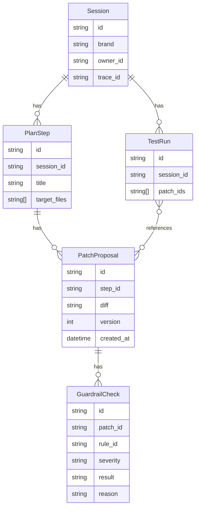
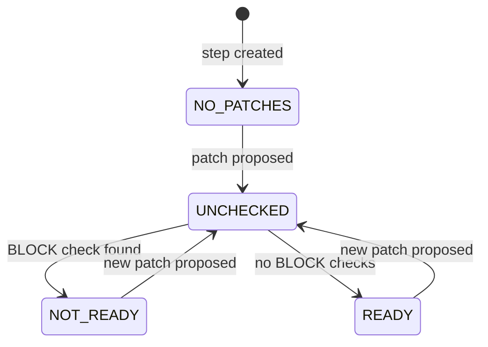

# case-02-session

Glovo-aware AI code review service for deciding whether an LLM-generated patch is safe to merge. Not a git apply or CI runner. The safety check between AI patch and merge.

---

## Problem & Approach

Glovo developers currently read LLM-generated diffs, remember brand guardrails, and decide manually whether a patch is mergeable. This service turns that workflow into a stateful HTTP API.

**API surface**

- `POST /sessions` - creates a review workspace.
- `POST /sessions/{id}/plan` - asks the LLM to split work into steps.
- `POST /sessions/{id}/plan/{stepId}/patches` - asks the LLM for one unified diff.
- `POST /sessions/{id}/patches/{patchId}/check` - runs deterministic G1-G5 checks.
- `GET /sessions/{id}/plan/{stepId}/readiness` - computes whether the latest patch can be considered merge-ready.
- `POST /sessions/{id}/test-runs` - records human or CI test evidence.
- `GET /sessions/{id}` - returns the nested session state.

**Architecture**

The LLM is wrapped on both sides by deterministic code. It only produces structured output (plan steps or diffs); validation, rule checks, and readiness are owned by the service.

```text
Request
  -> deterministic session, brand, and AGENTS.md context
  -> LLM generates only PlanStepInput or PatchProposalInput
  -> Pydantic validates the LLM payload
  -> deterministic guardrails run from AGENTS.md severities
  -> deterministic readiness is computed from stored checks
```

**Assumptions**

1. One session represents one developer's review workspace; cross-developer collaboration is out of scope.
2. Currently implemented for `brand="glovo"`; `Brand` already allows `efood` and `talabat` for extension.
3. Each brand has its own `AGENTS.md` (e.g., `glovo/AGENTS.md`) — read at check time, not at repo root.
4. Patches are proposals, not applied git changes; failed proposals remain history and a new patch can be generated.
5. `BLOCK` means not merge-ready. `WARN` means review required but not an automatic readiness block.
6. `trace_id` is generated per session and stored for future OTEL/export integration.

---

## Domain Model

```text
Session 1 -> * PlanStep 1 -> * PatchProposal 1 -> * GuardrailCheck
Session 1 -> * TestRun
TestRun * -> * PatchProposal by patch_ids
StepReadiness is computed, not stored
```

- `Session` - the developer's review workspace: `brand`, `owner_id`, `trace_id`, `steps`, `test_runs`.
- `PlanStep` - one LLM-created implementation step with target files.
- `PatchProposal` - one LLM-created unified diff for a step, plus immutable check results and `version`.
- `GuardrailCheck` - deterministic result for one rule: `ruleId`, `severity`, `result`, `reason`.
- `TestRun` - reviewer or CI evidence for one or more patch IDs. Does not override readiness directly.

**ERD**



**Readiness state**



**Trust Boundaries**

| Boundary | AI role | Deterministic code role |
|---|---|---|
| Planning | Splits title and description into steps | Validates `PlanStepInput`, enforces idempotency |
| Patch proposal | Produces a unified diff for one step | Stores as candidate; never applies to the repo |
| Guardrails | None | Runs G1-G5 regex checks; reads severities from `glovo/AGENTS.md` |
| Readiness | None | Uses latest patch by `created_at`, stored checks, and BLOCK count |
| Test evidence | None | Stores `TestRun` as evidence only |
| HTTP / brand rules | None | FastAPI/Pydantic validation, ownership checks, re-reads `AGENTS.md` at check time |

---

## Guardrail Rules (G1-G5)

Severities are read from `glovo/AGENTS.md` at check time.

| Rule | What it checks | Default severity |
|---|---|---|
| G1 | Money/price arithmetic uses `float` instead of `Decimal` | BLOCK |
| G2 | External URLs hardcoded instead of coming from `glovo.config` | BLOCK |
| G3 | Async DB access uses `engine.connect()` directly instead of `glovo.db.session` | BLOCK |
| G4 | Public handler does not forward `X-Glovo-Trace-Id` into structured logs | WARN |
| G5 | Public function missing a docstring with at least one `Args:` line | WARN |

`BLOCK` fails readiness. `WARN` is recorded but does not block merge.

---

## Design Decisions

### Readiness - which patch is the merge candidate?

A step can have multiple patch proposals. The question is which one counts for readiness.

| | How it works | Risk |
|---|---|---|
| Option A: latest checked patch | Only patches that have been checked are considered | An older clean patch silently makes a step look READY while a newer unchecked patch exists |
| Option B: latest patch by `created_at` | Always use the most recent proposal, checked or not | A step shows NOT_READY until the developer checks the new patch |

**Decision: Option B.** NOT_READY on an unchecked patch is accurate. READY on a stale one hides a newer patch the developer actually intends to merge.

`NOT_READY` means one of three things:
1. No patches exist for the step.
2. The latest patch exists but has not been checked.
3. The latest patch has at least one `BLOCK` check.

`WARN` checks do not block readiness - they signal review attention, not automatic merge rejection.

### Concurrency - how to handle double-check races?

Two tabs or a double-click can submit `POST /check` simultaneously for the same patch.

| | How it works | Risk |
|---|---|---|
| Option A: pessimistic lock | SELECT FOR UPDATE on the patch row | SQLite doesn't support it well; adds complexity |
| Option B: Redis distributed lock | Distributed lock acquired before check creation | Correct under high contention, but adds Redis to the stack |
| Option C: optimistic lock via `version` | CAS (Compare-And-Swap) on `version`; if another request changed it first, returns `409 version_conflict` | A race surfaces as a 409 to the user |

**Decision: Option C.** The realistic race is a same-user double-click, not high-contention multi-developer writes. CAS on SQLite is enough and keeps the stack simple.

### Why `POST /check` returns 409 on retry?

`POST /check` creates a check event, not a cache entry. Calling it twice for the same patch conflicts with the stored audit event, so the service returns `409 checks_already_exist` with the existing checks in the body - instead of returning a fake new check.

### Other decisions

| Background | Options | Decision | Reason |
|---|---|---|---|
| Patches represent AI attempts; applying them risks mutating the repo | Apply to repo vs store as candidate | Store as candidate | Allows repeated review without touching the real codebase |
| Checks reflect a specific diff at a specific point in time | Recompute on each readiness call vs store once | Store once | Immutability makes the audit trail trustworthy; AGENTS.md changes need explicit recompute |
| G1-G5 are brand policy rules, not logic bugs | Regex vs semantic/LLM-based analysis | Regex | Explainable, repeatable, no cross-file reasoning needed |

---

## Error Model

| Case | Status | Error |
|---|---:|---|
| Missing session path ID | 404 | `session_not_found` |
| Missing step path ID | 404 | `step_not_found` |
| Missing patch path ID | 404 | `patch_not_found` |
| Patch from another session in check path | 404 | `patch_not_found` |
| TestRun body references unknown patch | 422 | `patch_not_found_in_payload` |
| TestRun body references another session's patch | 422 | `patch_not_in_session` |
| Duplicate `POST /check` | 409 | `checks_already_exist` |
| Optimistic lock race | 409 | `version_conflict` |

Path IDs use 404 because the addressed resource is unavailable at that URL. Body IDs use 422 when the JSON is syntactically valid but violates session semantics.

---

## If More Time

- **Real auth** → replace `Bearer demo` with proper JWT or API key validation; current hardcoded token is for local development only.
- **MySQL / PostgreSQL** → swap SQLite for a real DB via docker-compose; add migrations and indexes for session/step/patch lookups.
- **OTEL** → export `trace_id`, LLM latency, guardrail outcomes, and readiness transitions as spans and metrics.
- **Multi-brand** → add `efood/AGENTS.md` and `talabat/AGENTS.md`; `Brand` enum already supports both - no route changes needed.
- **LLM-as-judge** → add an advisory semantic review layer after deterministic checks, but never let it override `BLOCK` rules directly.
- **Explicit recompute** → add `POST /patches/{id}/checks/recompute` for when `AGENTS.md` changes and stored results need to be invalidated.

---

## How to Run

### Setup

```bash
uv sync
uv run pytest
uv run fastapi dev src/main.py
```

Swagger UI: http://localhost:8000/docs

### Auth

All requests require an `Authorization` header. Any bearer value is accepted — there is no real token validation in local dev.

```bash
-H "Authorization: Bearer <any>"
```

### LLM

Without `ANTHROPIC_API_KEY`, the app runs on built-in mock data. With it, it calls the configured Anthropic model.

### Minimal glovo workflow

```bash
SESSION_ID=$(curl -s -X POST localhost:8000/sessions \
  -H "Authorization: Bearer dev" \
  -H "Content-Type: application/json" \
  -d '{"title":"Charge endpoint","description":"Add charge handler","brand":"glovo"}' \
  | python3 -c "import sys,json; print(json.load(sys.stdin)['id'])")

STEP_ID=$(curl -s -X POST localhost:8000/sessions/$SESSION_ID/plan \
  -H "Authorization: Bearer dev" \
  | python3 -c "import sys,json; print(json.load(sys.stdin)[0]['id'])")

PATCH_ID=$(curl -s -X POST localhost:8000/sessions/$SESSION_ID/plan/$STEP_ID/patches \
  -H "Authorization: Bearer dev" \
  | python3 -c "import sys,json; print(json.load(sys.stdin)['id'])")

curl -s -X POST localhost:8000/sessions/$SESSION_ID/patches/$PATCH_ID/check \
  -H "Authorization: Bearer dev" \
  | python3 -m json.tool

curl -s localhost:8000/sessions/$SESSION_ID/plan/$STEP_ID/readiness \
  -H "Authorization: Bearer dev" \
  | python3 -m json.tool
```