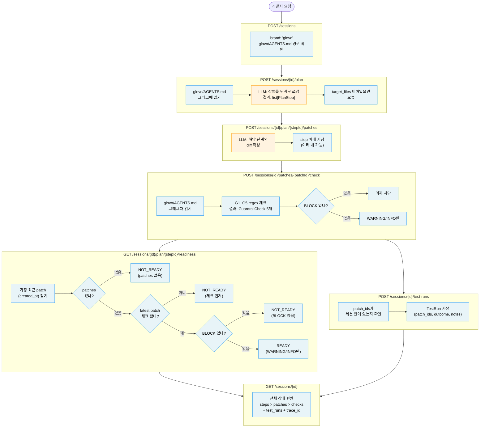

# SPEC - case-02-session

과제 파일: case-02-session/assignment.md
브랜드: glovo
시간: 4시간

---

## 뭘 만드는 건지

glovo 개발자가 AI가 만든 코드 변경을 검토할 때 쓰는 HTTP 서비스.

지금은 개발자가:
1. LLM이 만든 diff를 직접 읽고
2. glovo 규칙(G1~G5)에 맞는지 하나씩 확인하고
3. 여러 패치 중 어떤 게 머지해도 되는지 직접 판단한다

이 서비스를 쓰면:
- `POST /check` 하나로 5개 규칙 체크 결과가 바로 나온다
- `GET /readiness` 하나로 이 step을 머지해도 되는지 바로 알 수 있다
- `POST /test-runs` 로 리뷰어가 테스트 실행 결과를 기록할 수 있다

LLM이 하는 것: plan 쪼개기, diff 작성
서비스가 직접 하는 것: 규칙 체크, readiness 판단, TestRun 저장

---

## 엔드포인트 7개

| 번호 | 엔드포인트 | 하는 일 |
|---|---|---|
| 1 | POST /sessions | 작업 세션 만들기 |
| 2 | POST /sessions/{id}/plan | LLM이 작업을 단계로 쪼갬 |
| 3 | POST /sessions/{id}/plan/{stepId}/patches | LLM이 해당 단계의 코드 변경(diff) 작성 |
| 4 | POST /sessions/{id}/patches/{patchId}/check | G1~G5 규칙으로 패치 검사 |
| 5 | GET /sessions/{id}/plan/{stepId}/readiness | 이 step 머지해도 되는지 판단 |
| 6 | POST /sessions/{id}/test-runs | 테스트 실행 결과 기록 |
| 7 | GET /sessions/{id} | 전체 상태 조회 |

---

## 핵심 설계 결정 10가지

### 결정 1: 패치는 "후보 변경사항"이지 실제 적용이 아니다

패치를 만들어도 실제 코드베이스는 바뀌지 않는다.
LLM이 제안한 diff를 저장해두는 것일 뿐이다.

왜 이렇게 했냐면, AI 워크플로우는 반복적으로 수정하는 과정이기 때문이다.
- 패치 1 만들었는데 규칙 위반 2개 발견
- 패치 2로 수정
- 패치 3이 최종 후보

그래서 한 step 아래 패치가 여러 개 있어도 된다.
이전 패치가 실패해도 새 패치로 다시 시도하면 된다.

장점: 모델이 단순하고, readiness 계산이 쉽다
단점: 실제 git 상태를 반영하지 않는다, 패치 간 의존성을 추적하지 않는다

---

### 결정 2: Step readiness는 가장 최근 patch (created_at) 기준으로 계산한다

한 step에 패치가 여러 개 있을 때, readiness는 **created_at 기준 가장 최근 patch** 만 본다 (체크 여부 무관).

판단 기준:
- patches가 비어있으면: **NOT_READY**
- 가장 최근 patch가 아직 체크 안 됐으면: **NOT_READY** (→ POST /check 먼저)
- 가장 최근 patch에 BLOCK이 하나라도 있으면: **NOT_READY**
- BLOCK 없이 WARNING만 있거나 다 통과하면: **READY**

왜 "가장 최근 *체크된* patch" 가 아니라 "가장 최근 patch" 인가:

함정 시나리오:
```
patch1 (오래됨, 체크됨, BLOCK 0개) ✅
patch2 (최신, 체크 안됨)
```
- 옛날 답("가장 최근 체크된 patch") → patch1 보고 READY → **dev 가 patch2 머지 의도면 위험**
- 새 답("가장 최근 patch") → patch2 보고 NOT_READY → **dev 에게 "체크부터 해" 신호**

핵심: dev 의 멘탈 모델은 "내가 만든 가장 최근 patch 가 머지될 것" 임. 시스템 답이 이 모델과 어긋나면 사고 위험.

NOT_READY 가 나오는 3가지 경우 (README 명시):
1. patches 비어있음 → POST /patches 부터
2. 최신 patch 체크 안 됨 → POST /check 부터
3. 최신 patch 에 BLOCK 있음 → 코드 수정 후 새 patch

장점: 실제 개발 흐름과 맞다, dev 멘탈 모델과 정합, 검증 누락 사고 차단
단점: 패치 히스토리 추적 안 함 (의도된 스코프 — README §"더 발전시키면" 에 `Step.intent_patch_id` 경로)

---

### 결정 3: 규칙 체크 결과는 한번 저장하면 바꾸지 않는다

`POST /check`를 실행하면 G1~G5 결과가 패치에 저장된다.
readiness를 계산할 때 diff를 다시 분석하지 않고, 저장된 결과를 그대로 읽는다.

왜냐면 체크는 하나의 검증 이벤트다.
"이 diff를 이 시점에 체크했더니 이런 결과가 나왔다"는 기록이다.

장점: 결과가 일관적이고, 기록을 추적할 수 있고, readiness 계산이 빠르다
단점: 패치 내용이 바뀌면 다시 체크해야 한다 (하지만 패치는 수정하지 않고 새로 만드는 게 원칙이므로 문제없다)

---

### 결정 4: LLM이 만든 것과 사람/시스템이 확인한 것을 구분한다

| 리소스 | 누가 만드나 |
|---|---|
| Plan, Patch | LLM이 생성 |
| CheckResult | 서비스가 regex로 계산 |
| TestRun | 리뷰어 또는 CI가 기록 |

LLM이 "테스트 통과했다"고 해도, 실제 CI가 실패할 수 있다.
이 세 가지를 구분하는 게 설계의 핵심이다.
서비스는 LLM의 주장을 신뢰하지 않는다.

---

### 결정 5: TestRun은 세션 단위 리소스다

`POST /sessions/{id}/test-runs`

TestRun 하나에 여러 패치 ID를 연결할 수 있다.
실제 테스트는 보통 여러 변경사항을 한꺼번에 실행하기 때문이다.

TestRun 필드:
- `patch_ids`: 어떤 패치들을 테스트했는지
- `outcome`: PASS / FAIL / PARTIAL
- `notes`: 리뷰어 코멘트 (선택)

---

### 결정 6: 규칙별 심각도

| 규칙 | 심각도 | 이유 |
|---|---|---|
| G1: Decimal 안 쓰고 float 사용 | BLOCK | 금액 계산 오류 직결, 머지 불가 |
| G2: 외부 URL 하드코딩 | BLOCK | 보안 위반, 머지 불가 |
| G3: DB 세션 직접 접근 | BLOCK | 브랜드 규칙 위반, 머지 불가 |
| G4: trace_id 로그 미전달 | WARNING | 운영 관측 문제, 검토 필요 |
| G5: 공개 함수에 docstring 없음 | WARNING | 스타일 문제, 검토 필요 |

---

### 결정 7: 동시성 — 낙관적 락 (version 필드)

#### 워크로드 진단부터

락 메커니즘은 **경합 빈도**가 결정한다. 우리 도메인 분석:

| 락 종류 | 우리 case 에 있나 | 경합 양상 |
|---|---|---|
| (a) 공유 자원 락 (ex. 강좌 정원) | **❌ 없음** — 공유 카운터 자체가 없음 | N/A |
| (b) 주체별 제약 락 (ex. 같은 주체의 동시 요청) | ✅ 있음 — 같은 dev 가 같은 session 에 더블클릭/두 탭 | **매우 낮음** |

핵심 관찰:
- Session 은 한 dev 의 작업 공간 (다른 dev 가 안 들어옴)
- PlanStep, PatchProposal, GuardrailCheck, TestRun 모두 session 안 nested
- 두 dev 가 같은 patch 에 동시에 POST /check 하는 시나리오 *없음*
- 동시 요청 = 같은 dev 의 더블클릭/두 탭 수준

→ **(b) 만 있고, 경합 매우 낮은 워크로드.**

#### 메커니즘 후보 비교

| 메커니즘 | 경합 낮음에서 성능 | 멀티 worker | 멀티 머신 (DB 1대) | 인프라 추가 |
|---|---|---|---|---|
| `asyncio.Lock` per session | OK | ❌ (worker별 분리) | ❌ | 없음 |
| 글로벌 `asyncio.Lock` | 직렬화로 throughput 손해 | ❌ | ❌ | 없음 |
| `SELECT FOR UPDATE` (비관적) | 락 비용 발생 (불필요) | ✅ | ✅ | DB |
| **낙관적 락 (version + CAS)** | **★ retry 거의 안 일어남** | ✅ | ✅ | **없음** |
| Redis 분산 락 | OK | ✅ | ✅ | Redis 추가 |

**이 비교의 핵심**: 경합이 *본질적으로 낮은* 워크로드 (한 dev = 한 session) 에서는 비관적 락이 불필요한 throughput 손해. Redis 분산 락은 DB 자체가 분산일 때 의미 — 단일 DB 가정에선 오버엔지니어링. 낙관적 락이 두 축 (성능 + 멀티 인스턴스 안전) 모두 만족하는 유일한 답.

#### 메커니즘 풀이 — 낙관적 락 어떻게 동작하나

```python
class PatchProposal(BaseModel):
    ...
    version: int = 0  # 변경 시마다 +1

# POST /check
async def check(sid, pid):
    patch = store.get_patch(pid)
    if patch.checks:
        return existing_response(patch)  # idempotency (결정 5 와 짝)

    new_checks = run_guardrails(patch.diff)  # regex, 결정론적

    success = store.update_patch_if_version(
        pid, expected_version=patch.version, checks=new_checks
    )
    # 내부: UPDATE ... SET checks=?, version=? WHERE id=? AND version=?

    if not success:
        # 누군가 먼저 처리함 → 다시 읽으면 이미 결과 있음
        return existing_response(store.get_patch(pid))
    return new_response(...)
```

DB 가 `WHERE version=?` 를 *원자적으로* 처리 — worker/머신 수와 무관하게 안전. 분산 락 인프라 불필요.

#### 보조 처리

- **POST /patches, POST /test-runs**: 신규 INSERT 자체가 원자적 → 추가 락 불필요
- **데드락**: 한 operation 이 한 aggregate 만 만짐 → 두 락 동시에 안 잡음 → 락 순서 통일 의무 자동 충족

#### 가정 셋

- **전제**: 단일 DB. 경합 빈도 낮음 (한 dev = 한 session).
- **가정 깨질 시나리오 1**: 같은 patch 에 PATCH/PUT API 가 추가되어 dev 가 빠르게 여러 번 mutate → version conflict 잦아져 클라이언트 retry 폭주.
- **가정 깨질 시나리오 2**: DB 가 샤딩되어 같은 patch 가 여러 샤드에 분기 → `WHERE version=?` 의 원자성 보장 안 됨.
- **가정 깨질 시 행동**: 시나리오 1 은 비관적 락으로 메커니즘 교체 (`SELECT FOR UPDATE`). 시나리오 2 는 분산 락 (Redis SETNX) 또는 단일 라우팅으로 교체. README §"운영 강화" 에 두 경로 명시.

#### 동시성 사다리 위치

| 수준 | 접근 | 우리 선택 |
|---|---|---|
| 표면적 | synchronized / 단일 JVM 큐 | |
| 유능 | DB 비관적 락 | |
| **사려깊음** | **낙관적 락 + 재시도** | **★** |
| 깊음 | 분산 락 (Redis/ZooKeeper) | |
| 탁월 | 분산 트랜잭션 분석 | |

**왜 "사려깊음" 수준인가**: 위 (분산 락) 로 안 가는 이유 = DB 분산 아님. 아래 (비관적) 로 안 가는 이유 = 경합 낮음. 두 방향 모두 defend.

---

### 결정 8: POST /check 두 번 호출 시 → 409 Conflict

POST 는 HTTP 표준상 비멱등 메서드. 같은 patch 에 두 번 호출하면 두 번째는 **409 Conflict** 반환.

이유:
- HTTP 표준 (RFC 9110): POST 는 비멱등. 두 번째 호출이 200 + 기존 결과 주는 건 약속 위반.
- 결정 3 의 이벤트 모델 ("체크는 시점의 검증 기록") 과 정합: 이미 이벤트 있으면 새 이벤트 못 만듦.

응답 예시:
```http
HTTP/1.1 409 Conflict
{
  "error": "checks_already_exist",
  "patch_id": "...",
  "checks": [... 기존 5개 ...]
}
```

body 에 기존 결과 포함 — dev 가 추가 GET 안 해도 결과 받음.

가정 깨질 시: AGENTS.md 가 바뀌어 재검증 필요 → README §"더 발전시키면" 에 `DELETE /check` + `POST /check` 두 단계 또는 별도 `recompute` endpoint 경로.

장점: HTTP 표준 정합, 결정 3 과 일관, dev 가 두 번째 호출 명확히 인지
단점: 더블클릭 케이스에서 dev 가 409 본 후 GET 으로 결과 확인 (body 에 포함되긴 함)

---

### 결정 9: Error Model — 4xx 매핑

HTTP 표준에 따른 일관 매핑. RFC 7807 Problem Details 까지 가지 않고 FastAPI 기본 (`HTTPException`) 으로 충분.

#### Status Code 매핑 표

| 케이스 | Status | error 코드 (body 의 `error` 필드) |
|---|---|---|
| 존재 안 하는 session_id | 404 | `session_not_found` |
| 존재 안 하는 step_id (path 의 ID) | 404 | `step_not_found` |
| 존재 안 하는 patch_id (path 의 ID) | 404 | `patch_not_found` |
| Pydantic 입력 검증 실패 (target_files=[], JSON 형식 등) | 422 | (FastAPI 자동 처리) |
| TestRun.patch_ids 에 다른 세션의 patch | 422 | `patch_not_in_session` |
| TestRun.patch_ids 에 존재 안 하는 patch | 422 | `patch_not_found_in_payload` |
| POST /check 두 번째 호출 (이미 있음) | 409 | `checks_already_exist` (결정 8) |
| 낙관적 락 version 충돌 | 409 | `version_conflict` (결정 7, 사실상 결정 8 과 같은 분기) |
| 인증/권한 | — | 스코프 밖, README 만 |

#### 핵심 룰: 404 vs 422 의 선택

- **path 의 ID 가 없는 리소스** → 404 (URL 자체가 잘못)
- **body 의 ID 가 의미적으로 잘못** (다른 세션 patch 등) → 422 (형식은 맞는데 비즈니스 룰 위반)

이 룰만 일관 적용.

#### Body 형식

```json
{
  "error": "patch_not_found",
  "message": "Patch <uuid> not found in session <uuid>"
}
```

- `error` = enum (machine-readable, 클라이언트 분기용)
- `message` = 사람이 읽는 설명

#### 코드 모양

```python
class APIError(HTTPException):
    def __init__(self, status_code: int, error: str, message: str, **extra):
        super().__init__(
            status_code=status_code,
            detail={"error": error, "message": message, **extra}
        )

# 사용
raise APIError(404, "patch_not_found", f"Patch {pid} not found in session {sid}")
```

가정 깨질 시: 인증/권한 추가 시 → 401/403 추가. README §"운영 강화" 에 경로.

---

### 결정 10: LLM 호출 — API key 있으면 진짜, 없으면 자동 mock

`OPENAI_API_KEY` 또는 `ANTHROPIC_API_KEY` 환경변수 유무로 자동 분기. 평가자가 .env 안 만들어도 `docker-compose up` 한 줄로 동작.

#### 패턴

```python
# src/llm.py
def get_llm() -> LLM:
    if os.getenv("OPENAI_API_KEY") or os.getenv("ANTHROPIC_API_KEY"):
        return RealLLM()
    return MockLLM()  # 자동 fallback
```

#### Mock 의 핵심 결정 — 과제 sample_diff.patch 반환

Mock 의 `generate_patch` 가 과제에서 준 sample_diff.patch 그대로 반환.

```python
class MockLLM(LLM):
    def generate_patch(self, step: PlanStep) -> str:
        return SAMPLE_DIFF  # 과제 명세의 sample_diff.patch
    
    def generate_plan(self, description: str) -> list[PlanStepInput]:
        # description 기반 결정론적 plan
        return [PlanStepInput(
            description="Add payment charge handler",
            target_files=["payments/charge.py"]
        )]
```

이렇게 하면:
- 평가자가 quickstart 그대로 따라하면 → POST /check 시 G1~G5 가 자동 5/5 fail
- 과제 평가 항목 ("at least G1, G2, G3, G4, G5 all to flag") 자동 시연
- 결정론적 (같은 입력 = 같은 출력)

#### 장점

- "<1분 클론 후 실행" 평가 항목 자동 통과 (.env 없이 docker-compose up)
- API 비용 0 (CI/평가자 환경)
- Mock 결과가 과제 시나리오와 정확히 매치 → README quickstart 가 시연 데모로 자동 변환
- Dev 본인 API key 로 실제 LLM 동작 시연도 가능

#### README 한 단락

> **LLM 호출**: `OPENAI_API_KEY` 또는 `ANTHROPIC_API_KEY` 환경변수 있으면 실제 LLM, 없으면 자동 mock fallback. Mock 은 과제 sample_diff.patch 를 반환하여 G1~G5 시연이 .env 없이도 자동 동작. 평가자는 `docker-compose up` 한 줄로 전체 시연 가능.

가정 깨질 시: LLM 응답 형식이 바뀌거나 더 복잡한 plan 생성이 필요해지면 → Mock 도 함께 업데이트. 또는 recorded fixture (과거 LLM 응답 저장) 로 전환.

---

## 이번 구현에 포함하지 않는 것들

- 실제 git apply 또는 머지 실행
- 브랜치/리베이스 모델
- 실제 테스트 실행 환경
- 패치 간 의존성 추적
- 인증/권한
- 데이터베이스 영속성 (메모리 저장 사용, README에 SQLite 전환 경로 설명)
- 분산 락 인프라 (Redis SETNX 등) — 단일 DB 가정에서 낙관적 락으로 충분 (결정 7). DB 분산 시 README §"운영 강화" 경로

---

## 구현 범위

**0~120분 (반드시 완료)**
- 엔드포인트 1~7 전부
- G1~G5 규칙 체크 (glovo/AGENTS.md 읽어서 심각도 결정)
- pytest 기본 통과

**120~180분 (완성도)**
- trace_id 전파
- readiness 통합 테스트
- E2E 시나리오 확인

**README 언급만**
- SQLite, 인증, OTEL, 멀티브랜드, retry 루프

이전 구현(case-01-session-second) 패턴 재사용,
glovo 브랜드 + G1~G5 규칙 + 패치 복수화 + readiness + TestRun 추가

---

## 데이터 구조

### 리소스 간 관계
```
Session
  └── PlanStep (여러 개)
        └── PatchProposal (여러 개)
              └── GuardrailCheck (G1~G5, 항상 5개)
  └── TestRun (여러 개, 여러 패치 참조 가능)

StepReadiness: PlanStep 조회 시 계산, 저장하지 않음
```

### 데이터 모델 (Python)
```python
Brand = Literal["efood", "glovo", "talabat"]
Severity = Literal["BLOCK", "WARN", "INFO"]
CheckResult = Literal["pass", "fail"]
ReadinessVerdict = Literal["READY", "NOT_READY"]

class GuardrailCheck(BaseModel):
    ruleId: str           # "G1" ~ "G5"
    severity: Severity    # glovo/AGENTS.md에서 읽어서 결정
    result: CheckResult
    reason: str           # 예: "float 사용 감지 - per glovo/AGENTS.md G1"

class PatchProposal(BaseModel):
    id: UUID
    step_id: UUID
    brand: Brand
    diff: str             # unified diff 문자열
    checks: list[GuardrailCheck] = []
    version: int = 0      # 낙관적 락용. 변경 시마다 +1 (결정 7)
    created_at: datetime

class PlanStep(BaseModel):
    id: UUID
    description: str
    target_files: list[str]
    patches: list[PatchProposal] = []  # 여러 개 가능

class TestRun(BaseModel):
    id: UUID
    session_id: UUID
    patch_ids: list[UUID]
    outcome: Literal["PASS", "FAIL", "PARTIAL"]
    notes: str = ""
    created_at: datetime

class Session(BaseModel):
    id: UUID
    title: str
    description: str
    brand: Brand
    trace_id: UUID        # 나중에 OTEL 연결할 때 쓰는 ID
    steps: list[PlanStep] = []
    test_runs: list[TestRun] = []
    created_at: datetime
```

### LLM에게 넘기는 스키마 (LLM이 채워야 하는 필드만)
```python
class PlanStepInput(BaseModel):
    description: str
    target_files: list[str]

class PatchProposalInput(BaseModel):
    diff: str
```

### 각 엔드포인트가 반환하는 스키마 (해당 엔드포인트가 만든 것만)
```python
# POST /plan 응답 - 패치는 이 단계에서 안 만들었으니 포함 안 함
class PlanStepOut(BaseModel):
    id: UUID
    description: str
    target_files: list[str]

# POST /patches 응답 - 규칙 체크는 이 단계에서 안 했으니 포함 안 함
class PatchProposalOut(BaseModel):
    id: UUID
    step_id: UUID
    diff: str
    created_at: datetime

# GET /readiness 응답
class StepReadinessOut(BaseModel):
    step_id: UUID
    verdict: ReadinessVerdict
    block_count: int
    warn_count: int
    latest_patch_id: UUID | None    # 어떤 patch 기준인지 노출 (결정 2)

# POST /test-runs 응답
class TestRunOut(BaseModel):
    id: UUID
    session_id: UUID
    patch_ids: list[UUID]
    outcome: Literal["PASS", "FAIL", "PARTIAL"]
    notes: str
    created_at: datetime
```

---

## 아키텍처 다이어그램



파란 박스: 서비스가 직접 처리 (결과 예측 가능)
주황 박스: LLM이 처리 (결과가 매번 다를 수 있음)

---

## 과거 실수에서 배운 것 (이번에 반드시 확인)

| 이전 실수 | 이번에 할 것 |
|---|---|
| main.py에 load_dotenv() 빠짐 | Agent A 프롬프트 첫 줄에 명시 |
| LLM에 domain model 통째로 넘겨서 LLM이 패치까지 채움 | PlanStepInput, PatchProposalInput 따로 정의 |
| guardrails.py가 AGENTS.md 실제로 안 읽음 | _parse_severities(brand) 구현 필수, 리트머스 테스트 실행 |
| curl 파이프 파싱 오류로 서버 정상인데 실패로 오판 | 항상 파일로 받아서 파싱 |

---

## JD Signal Map

JD(채용공고)에서 중요하게 보는 키워드 11개가 이 구현 어디에 나타나는지 정리한 표.
이 표에 있는 키워드가 코드나 README에 보이지 않으면 감점이다.

| JD 키워드 | 이 구현에서 어떻게 보여주나 | 코드/문서 위치 |
|---|---|---|
| `Git worktrees` | Agent A(라우트+LLM)와 Agent B(guardrail+테스트)를 별도 워크트리에서 동시에 구현 | CODEX_PROMPTS.md 워크트리 설정, git log |
| `multi-agent` | Agent A와 Agent B가 독립적으로 각자 작업, merge로 합침 | CODEX_PROMPTS.md Prompt 1, 2 |
| `AGENTS.md / Engineering Manifesto` | glovo/AGENTS.md를 LLM 호출 직전에 그때그때 읽어서 컨텍스트로 주입. G1~G5 심각도도 이 파일에서 읽어서 결정 | `src/llm.py`, `src/guardrails.py` |
| `guardrails - safe to deploy` | `GuardrailCheck(ruleId, severity, result, reason)` 구조로 G1~G5 체크. BLOCK 하나라도 있으면 step readiness가 NOT_READY | `src/guardrails.py`, `GET /readiness` |
| `multi-brand (efood/glovo/talabat)` | `Session.brand` 필드가 있고, guardrail 로더가 brand로 파라미터화됨. 이번에는 glovo만 구현 | `src/models.py`, `src/guardrails.py` |
| `context integration` | glovo/AGENTS.md를 LLM 시스템 프롬프트에 넣어서 plan/patch 생성 시 brand 규칙을 LLM이 알게 함 | `src/llm.py` 시스템 프롬프트 |
| `OTEL / OAM / tracing` | `Session.trace_id`를 세션 생성 시 만들어서 모든 응답에 포함. 나중에 OTEL span으로 내보낼 수 있는 구조 | `src/models.py`, README §더 하고 싶었던 것 |
| `deterministic boundary` | G1~G5 규칙 체크는 regex만 사용. LLM은 plan 쪼개기와 diff 작성만 담당 | README 아키텍처 다이어그램 |
| `developer productivity / friction` | 개발자가 직접 diff를 읽고 G1~G5를 하나씩 확인하는 과정을 `POST /check` 하나로 대체 | README §문제와 접근 방식 |
| `customizing cutting-edge agentic IDE` | "Cursor 클론이 아니라, glovo 규칙을 주입하는 DH용 통합 레이어" | README 첫 줄 |
| `measurement / KPI` | `GuardrailCheck` 결과와 `TestRun.outcome(PASS/FAIL/PARTIAL)`이 코드 품질 대시보드 데이터로 쓰일 수 있음 | README §더 하고 싶었던 것 |
| `concurrency reasoning` | 워크로드 진단 → 메커니즘 선택 → 가정 깨질 시 다음 행동까지. 낙관적 락 (version 필드) + 단일 DB 가정 명시 + 분산 환경 전환 경로 README 명시 | `src/models.py` (version 필드), `src/store.py` (CAS 메서드), README §운영 강화 |

**제출 전 확인**: 위 표의 모든 행이 코드 또는 README 텍스트에 1개 이상 대응되어야 한다.

---

## Design Principles

이 구현에 적용한 5가지 설계 원칙.

### 원칙 1: 엔드포인트 하나에 책임 하나 (SRP)

엔드포인트 하나 = 상태 변환 하나.

| 엔드포인트 | 책임 | 하면 안 되는 것 |
|---|---|---|
| `POST /sessions` | 세션 만들기 | plan 생성, LLM 호출 |
| `POST /plan` | 설명을 단계(PlanStep)로 쪼개기 | diff 작성, guardrail 실행 |
| `POST /patches` | 단계 하나의 diff 작성 | guardrail 실행, 다른 단계 수정 |
| `POST /check` | G1~G5 체크 결과 저장 | 새 diff 생성, plan 다시 만들기 |
| `GET /readiness` | 저장된 체크 결과 읽어서 판단 | 새로 체크 실행 |
| `POST /test-runs` | TestRun 저장 | 패치 내용 수정 |
| `GET /sessions/{id}` | 전체 상태 반환 | 어떤 계산도 새로 실행 |

응답 스키마도 SRP를 따른다. `POST /plan` 응답에 `patches` 필드가 있으면 안 된다. 그 단계에서 patches를 만들지 않았으니까.

### 원칙 2: 결정론적 경계 (Deterministic Boundary)

LLM은 항상 결정론적 코드 사이에 끼어 있다.

```
[결정론적 입력]  →  [LLM]  →  [결정론적 출력]
  스키마 검증         제안만       G1~G5 regex 체크
  AGENTS.md 로드      한다         Pydantic 파싱
  brand 결정
```

guardrails.py에는 LLM 호출이 없다. llm.py에는 비즈니스 로직이 없다.

### 원칙 3: 필요한 것만 만들기 (YAGNI)

spec에 없으면 P2(README 언급만). 이번에 P2로 남긴 것들:
- 실제 SQLite 저장 (메모리 저장 사용)
- 인증/권한
- 실제 테스트 실행 환경
- OTEL export
- LLM-as-judge guardrail

응답 스키마도 YAGNI를 따른다. 그 엔드포인트가 만든 필드만 반환한다.

### 원칙 4: 워크플로우 먼저 (Workflow-first)

엔드포인트를 설계하기 전에 상태 변환 흐름을 먼저 그린다.

```
없음 → Session(steps=[]) → Session(steps=[PlanStep(patches=[])]) → Session(...patches=[PatchProposal(checks=[])]) → Session(...checks=[GuardrailCheck x5])
```

화살표 하나 = 엔드포인트 하나. 두 단계를 한 번에 건너뛰는 엔드포인트는 없다.

### 원칙 5: 설명 가능성 (Explainability)

AI가 한 모든 결정은 사람이 추적할 수 있어야 한다.

| 레이어 | 어떻게 추적 가능하게 했나 |
|---|---|
| Plan 생성 | `PlanStep.description`은 사람이 읽을 수 있는 텍스트 |
| Patch 생성 | `PatchProposal.diff`는 표준 unified diff |
| Guardrail 결과 | `GuardrailCheck.reason`이 "float 사용 감지 - per glovo/AGENTS.md G1" 형식으로 어느 규칙인지 명시 |
| 세션 감사 | `Session.trace_id`로 나중에 OTEL span 연결 가능 |
| AI vs 사람 | README에 "AI가 한 것 / 사람이 한 것" 표 명시 |

`GuardrailCheck.result = "fail"`인데 `reason = "error"`이면 쓸모없다. reason은 반드시 어느 규칙, 어떤 패턴 때문인지 명시한다.
