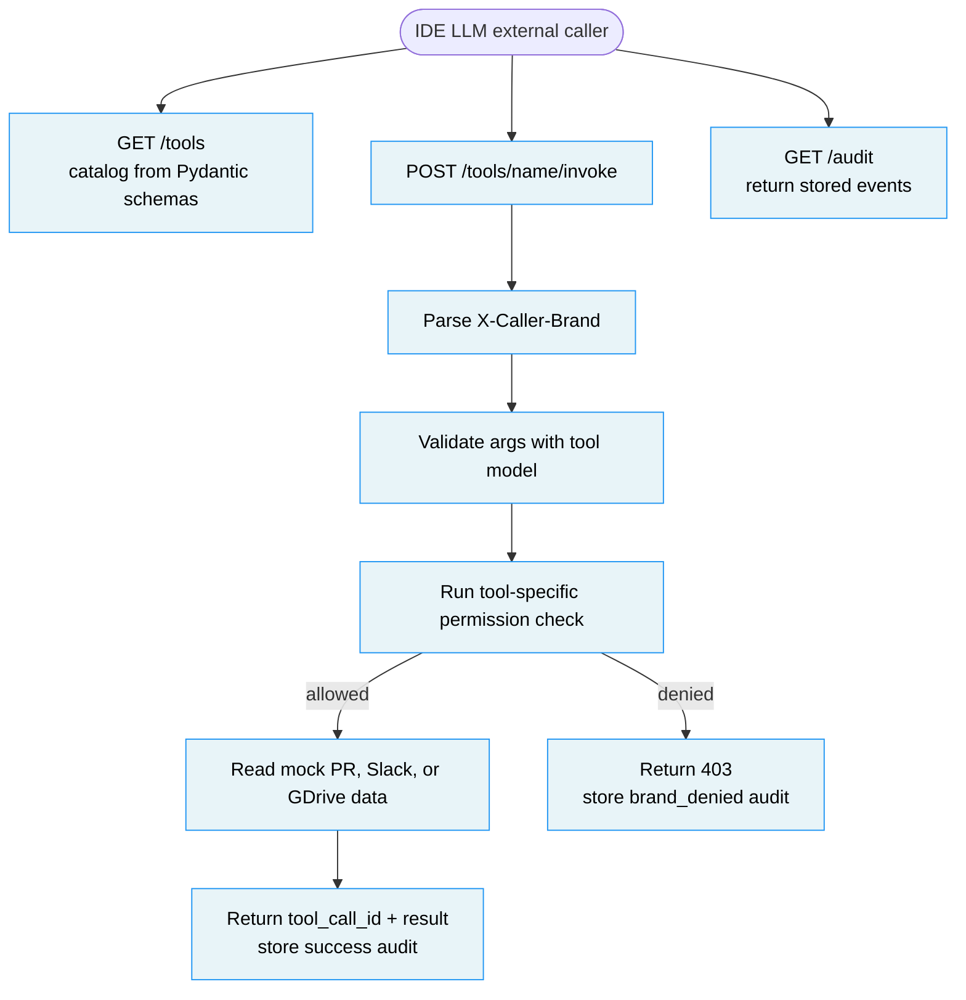

# DH Context Injection Server

Context provider layer between an IDE LLM and DH internal systems. Not a proxy or a real Slack, GitHub, or Google Drive integration. The service validates tool arguments, enforces brand permissions, runs mock backends, and records audit events.

## 1. Problem & Approach

**What this replaces**

An IDE LLM reading PR, Slack, and document context directly, without a brand boundary or a reviewable audit trail.

This follows the Multi-brand Awareness rule in `AGENTS.md`. Every entity carries a brand, and brand-specific access rules override global behavior. `X-Caller-Brand` is the only caller identity source. `args.brand` describes the requested target, not the caller.

**API surface**

- `GET /tools` - returns the tool catalog, Pydantic-derived argument schemas, and brand requirements.
- `POST /tools/{name}/invoke` - validates args, checks permission, executes one mock tool, and writes one audit event.
- `GET /audit` - returns invocation history, including successful and denied calls.

**Architecture**

The LLM is an external caller. Inside the service, every step is deterministic code.



**Assumptions**

1. Audit storage is in memory. If the requirement expands, move `AuditStore` behind PostgreSQL or MySQL with the same model shape.
2. Caller identity comes only from `X-Caller-Brand`. Real auth belongs in a gateway or JWT/API key validator.
3. `args.brand` is still validated because tools need a target brand.
4. Pydantic models are the single source for both catalog schema and invoke validation.
5. Audit stores `result_summary`, not full Slack text or document content.
6. Denied calls are audit events because reviewers need to see boundary probes.

## 2. Domain Model

```text
ToolDefinition is fixed catalog metadata
ToolInvocation is an audit event created for each validated invocation attempt
AuditRecord is the external audit shape defined in models.py
```

- `ToolDefinition` - catalog entry with `name`, `description`, `args_schema`, and `brand_requirements`.
- `SearchPrsArgs`, `GetSlackMessagesArgs`, `FetchGdriveDocArgs` - strict argument contracts with `extra="forbid"`.
- `ToolInvokeResponse` - caller-facing result with `tool_call_id` and tool result.
- `ToolInvocation` - stored event with caller brand, args, outcome, reason, summary, latency, and timestamp.
- `AuditRecord` - public audit record shape, currently identical to `ToolInvocation`.

**Trust Boundaries**

| Boundary | AI role | Deterministic code role |
|---|---|---|
| Caller identity | Sends `X-Caller-Brand` | Validates it against `efood`, `glovo`, and `talabat` |
| Tool arguments | Sends JSON args | Pydantic rejects unknown fields and invalid values |
| Brand permission | None | Three `check_` functions enforce PR, Slack, and GDrive rules |
| Backend result | None | Mock data is filtered or fetched after permission succeeds |
| Audit trail | None | Success, schema invalid, and brand denied outcomes are stored with `tool_call_id` |

## 3. Design Decisions

### Permission model by tool

The target brand is not enough for every tool because each internal system uses a different ownership signal.

| Option | How it works | Risk | Decision |
|---|---|---|---|
| Option A - always compare `caller_brand == args.brand` | One rule handles all tools | GDrive can be tricked if `args.brand` lies about the document owner | No |
| Option B - use a tool-specific check | PR compares target brand, Slack checks a channel whitelist, GDrive checks document metadata | Slightly more code per tool | Yes |
| Option C - trust mock data only | Backend returns whatever matches the args | Cross-brand reads become normal behavior | No |

**Decision is Option B.** The service uses three explicit permission checks because PR, Slack, and GDrive expose ownership differently.

### Schema as contract

The catalog and invocation path must not drift.

| Option | How it works | Risk | Decision |
|---|---|---|---|
| Option A - handwrite JSON schemas | `/tools` returns manually maintained schemas | Route validation can drift from the catalog | No |
| Option B - derive schemas from Pydantic | `/tools` calls `model_json_schema()` on the same args models used by invoke | Catalog shape follows Pydantic naming | Yes |
| Option C - accept free-form args | Tools inspect dicts at runtime | Validation errors become late and inconsistent | No |

**Decision is Option B.** Pydantic is the single source of truth for tool contracts.

### Other decisions

| Background | Options | Decision | Reason |
|---|---|---|---|
| Unknown tool handling | 404 vs empty result | 404 | The caller named a missing route resource |
| Schema failure handling | 400 vs 422 | 422 | The route exists, but the request body is invalid for the selected tool |
| Audit result payload | Full content vs summary | Summary | The caller gets the result, while audit avoids storing full document or Slack body text |

## 4. Error Model

| Case | Status | Error |
|---|---:|---|
| Invalid or missing `X-Caller-Brand` | 400 | `invalid X-Caller-Brand` |
| Unknown tool name | 404 | `unknown tool` |
| Args fail Pydantic validation | 422 | Pydantic error list |
| Brand permission denied | 403 | Tool-specific denial reason |

## 5. AI Usage Log

I used AI to split the work into two implementation tracks. One track handled tool catalog and invocation flow. The other handled audit store and audit route. The merge history keeps both branch names visible through `feat/tools-invoke` and `feat/audit-store`.

| Part | Verification |
|---|---|
| Tool catalog | `GET /tools` test checks schema titles derived from Pydantic |
| Permission boundary | Route tests cover cross-brand PR denial, Slack whitelist checks, and GDrive metadata ownership |
| Audit store | Audit tests cover empty state, brand filter, limit, and newest-first ordering |
| README | Cross-checked against `SPEC.md`, route decorators, models, permissions, and grep signals |

## 6. If More Time

- **Real auth** - replace `X-Caller-Brand` trust with JWT or API key validation, then derive caller brand from verified claims.
- **PostgreSQL or MySQL audit store** - persist `ToolInvocation` events with indexes on `caller_brand`, `tool_name`, and `called_at`.
- **Real connectors** - replace mock PR, Slack, and GDrive data behind the existing tool functions.
- **Rate limits** - protect internal systems from repeated tool calls by caller brand and tool name.
- **OTEL export** - emit spans keyed by `tool_call_id` and feed denial rate into reviewer dashboards.
- **KPI dashboard** - use `GET /audit` data to track permission denial rate and tool usage by brand.

## How to Run

Credentials are not required because the service uses mock backend data.

```bash
uv sync
uv run pytest
uv run fastapi dev src/main.py
```

Swagger UI `http://localhost:8000/docs`

```bash
curl -s http://localhost:8000/tools | python3 -m json.tool

curl -s -X POST http://localhost:8000/tools/search_prs/invoke \
  -H "Content-Type: application/json" \
  -H "X-Caller-Brand: efood" \
  -d '{"brand":"efood","query":"checkout","limit":5}' \
  | python3 -m json.tool

curl -s -X POST http://localhost:8000/tools/search_prs/invoke \
  -H "Content-Type: application/json" \
  -H "X-Caller-Brand: efood" \
  -d '{"brand":"glovo","query":"ETA","limit":5}' \
  | python3 -m json.tool

curl -s -X POST http://localhost:8000/tools/get_slack_messages/invoke \
  -H "Content-Type: application/json" \
  -H "X-Caller-Brand: efood" \
  -d '{"brand":"efood","channel":"C-EFOOD-OPS","since":"2026-05-10T01:30:00+00:00"}' \
  | python3 -m json.tool

curl -s -X POST http://localhost:8000/tools/fetch_gdrive_doc/invoke \
  -H "Content-Type: application/json" \
  -H "X-Caller-Brand: efood" \
  -d '{"brand":"efood","doc_id":"doc-efood-checkout"}' \
  | python3 -m json.tool

curl -s http://localhost:8000/audit | python3 -m json.tool
```
