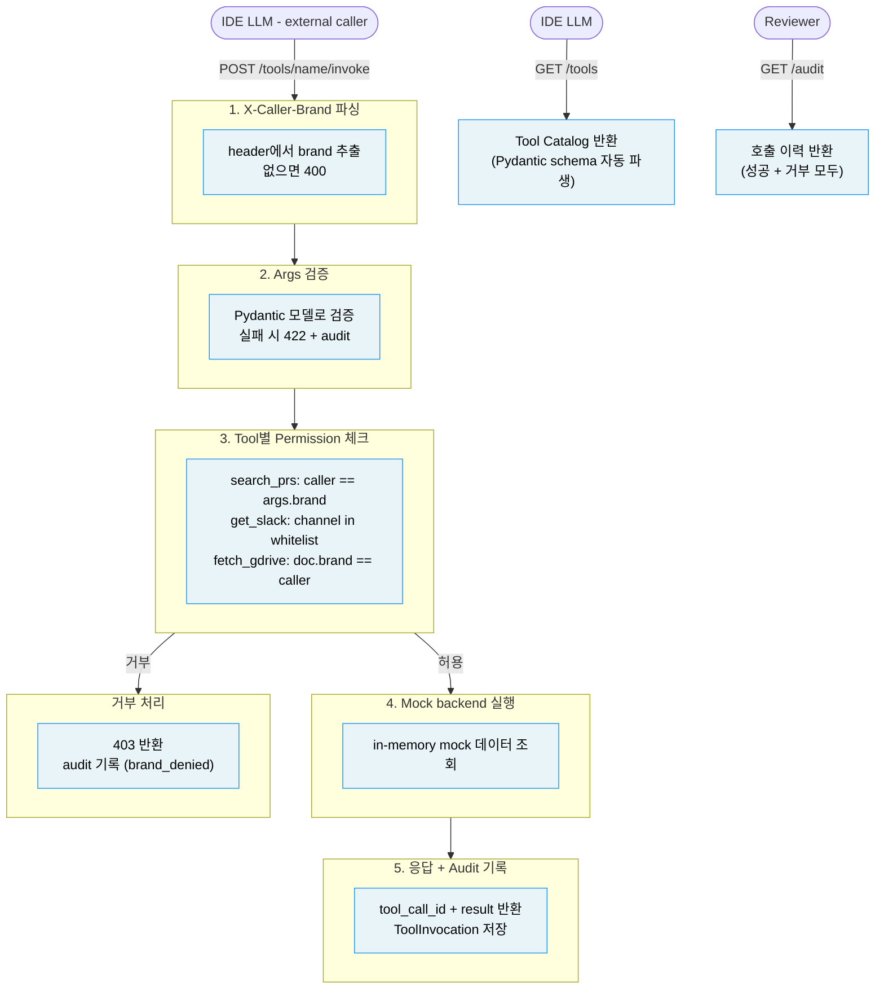

# DH Context Injection Server — 설계 결정 기록

> 이 파일은 코코와 설계 Q&A를 진행하며 내린 결정을 순서대로 기록한다.
> 각 결정은 번호로 참조할 수 있다.

---

## Problem (결정 1 — XY-30S)

- WHO: IDE 안의 LLM (Cursor/Claude Code) — internal context가 필요한 클라이언트
- WHAT friction: LLM이 PR/Slack/GDrive에 직접 접근하면 brand boundary가 없고 audit도 없음. 서버가 tool contract 정의, permission 강제, 호출 기록을 담당
- LLM이 만들어서 결과가 매번 다른 부분: 없음. 이 서비스 자체에는 LLM 호출이 없다. LLM은 caller이고 서버는 tool provider다
- 외부 서비스 연결: Slack API, GitHub PR API, GDrive API는 전부 mock. X-Caller-Brand header가 유일한 caller identity 소스

---

## Risks (결정 2)

| Risk | 대응 방향 |
|------|-----------|
| LLM이 args.brand를 위조해서 cross-brand 접근 시도 | permission 기준은 X-Caller-Brand header만. args.brand는 조회 대상이지 신원이 아님 |
| denied call을 audit에 빠뜨림 | 요청 받는 즉시 tool_call_id 생성, 성공/거부 모두 audit에 기록 |
| mock 데이터에 brand ownership 없어서 permission 검증이 무의미 | MOCK_DOCS, MOCK_SLACK 전부 brand 필드 포함 |
| GET /tools 스키마와 POST /invoke 검증이 drift | Pydantic 모델 하나를 source of truth로, .model_json_schema()로 카탈로그 생성 |
| audit에 secret 노출 (Slack text, GDrive content 전문) | result_summary만 저장, 본문 제외 |

---

## Scope (결정 3)

| Tier | 내용 | 시간 |
|------|------|------|
| P0 | 엔드포인트 3개 (GET /tools, POST /tools/{name}/invoke, GET /audit) + 브랜드 permission 3종 + 거부 포함 audit + pytest 초록 | 0–90분 |
| P1 | args schema validation 에러 메시지 정리 + audit latency_ms + README 완성 | 90–150분 |
| P2 | README만 언급: 실제 Slack/GDrive/PR API, SQLite 영속화, rate limit, full OTEL |

Mock 데이터: 각 tool당 brand별 2-3개 레코드 (cross-brand denial 테스트 가능하도록) — 결정 3a

---

## README Plan (결정 4)

§1 Problem & Approach
- What this replaces: IDE LLM이 Slack/GDrive/PR에 직접 접근할 때 brand boundary도 audit도 없는 문제
- 이 서비스: LLM과 내부 시스템 사이에서 permission 강제, args 검증, 호출 기록을 담당하는 문지기
- API surface: GET /tools, POST /tools/{name}/invoke, GET /audit
- Assumptions 6개: in-memory audit, X-Caller-Brand가 유일한 신원, args.brand는 조회 대상, Pydantic 단일 소스, result_summary만 저장, 거부 호출도 audit 기록

§2 Domain Model
- ToolDefinition과 ToolInvocation 두 entity (case-01과 달리 nested 계층 없음)

§3 Design Decisions
- 핵심 결정 2개: permission 모델 (tool별 기준 다름), schema-as-contract (Pydantic 단일 소스)

§4 Error Model
- 403: permission denied, 422: schema invalid, 404: 알 수 없는 tool

§5 AI Usage Log + If More Time

---

## Domain Model (결정 5)

Entity 관계: ToolDefinition (catalog, 고정) / ToolInvocation (audit, 호출마다 생성)

```
ToolDefinition  — 서버 시작 시 고정, 3개 (search_prs / get_slack_messages / fetch_gdrive_doc)
ToolInvocation  — 호출마다 생성, in-memory list
```

ToolInvocation 필드:
- tool_call_id: UUID
- caller_brand: Brand
- tool_name: str
- args: dict (원본 그대로 — 결정 5a, secret 없는 tool이므로 OK)
- outcome: "success" | "schema_invalid" | "brand_denied" | "tool_error"
- denial_reason: str | None
- result_summary: str | None (본문 제외, 요약만)
- latency_ms: int
- called_at: datetime

Schema 구조 (case-01의 3-tier를 이 assignment에 맞게 조정):
- SearchPrsArgs / GetSlackMessagesArgs / FetchGdriveDocArgs — args 검증 + catalog schema 생성 모두 이 모델에서 파생
- ToolInvokeResponse — tool_call_id + result (LLM에게 돌려주는 것)
- AuditRecord — GET /audit 응답 (ToolInvocation과 동일 구조, 외부 노출용)

---

## Architecture (결정 6)

Opening sentence: "This service is the context provider layer between the IDE's LLM and DH internal systems. The LLM calls tools; the server validates, permits, executes, and records."

Positioning sentence: "It is not a proxy. It is the brand-aware permission boundary that ensures an LLM working in one brand's context cannot read another brand's PRs, Slack channels, or documents."

흐름 (서버 전체 deterministic — LLM 박스는 외부 caller):



파란 박스만: 서비스 전체가 deterministic (LLM 호출 없음)

---

## JD Signal Map (결정 7)

| JD Keyword | 매핑 위치 | 비고 |
|---|---|---|
| Git worktrees | wt-tools (routes+invoke+mock) / wt-audit (audit store+GET /audit), git log에 브랜치 보임 | 결정 7-1 |
| multi-agent | Agent A (wt-tools) + Agent B (wt-audit) 병렬 실행 | 결정 7-2 |
| AGENTS.md / Engineering Manifesto | README §1에 "follows Multi-brand Awareness rule in AGENTS.md" 한 줄. brand 필드가 모든 entity에 포함 | 결정 7-3 |
| guardrails — safe to deploy | permission 거부 = guardrail. outcome: "brand_denied" + 403 반환 | 결정 7-4 |
| multi-brand (efood/glovo/talabat) | Brand Literal, X-Caller-Brand header, 3개 brand mock 데이터 | 결정 7-5 |
| context integration | 서버 자체가 context provider. README opening sentence에 명시 | 결정 7-6 |
| OTEL / OAM / tracing | tool_call_id: UUID + latency_ms. If More Time에 OTEL export 언급 | 결정 7-7 |
| deterministic boundary | 서버 전체 deterministic (LLM 호출 없음). README에 명시 | 결정 7-8 |
| developer productivity / friction | README §1 What this replaces: LLM이 내부 context를 수동으로 접근하던 friction 제거 | 결정 7-9 |
| customizing cutting-edge agentic IDE | Positioning sentence: "not a proxy — brand-aware permission boundary" | 결정 7-10 |
| measurement / KPI | GET /audit로 거부율, tool 호출 패턴 확인 가능. If More Time에 KPI 대시보드 언급 | 결정 7-11 |

---

## Design Principles Applied (결정 8)

| 원칙 | 이 assignment 적용 |
|---|---|
| SRP | GET /tools는 catalog만, POST /invoke는 실행+audit만, GET /audit은 조회만. 한 endpoint가 두 가지 일 안 함 |
| Deterministic Boundary | 서버 안에 LLM 없음. args 검증, permission, mock 실행, audit 기록 전부 deterministic |
| YAGNI | 실제 Slack/GDrive/PR API, SQLite, rate limit, auth 전부 P2. 과제 spec에 없음 |
| Workflow-first | LLM이 tool 쓰는 흐름: catalog 조회 → invoke → audit 확인. 각 endpoint가 이 흐름의 화살표 하나 |
| Explainability | audit에 caller_brand, tool_name, args, outcome, denial_reason 전부 기록. reviewer가 "왜 거부됐는지" 추적 가능 |
