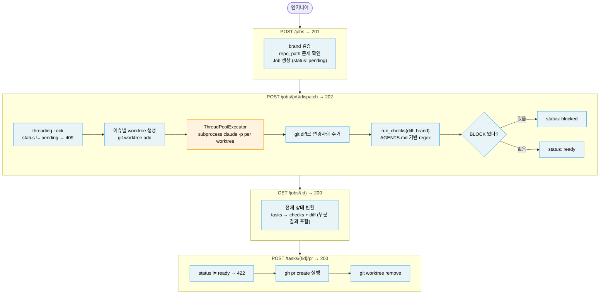

# Worktree Orchestrator

This service lets an engineer dispatch one job into isolated coding tasks, then review each task before opening a PR. Not a Cursor clone. It coordinates Claude Code, git worktrees, and AGENTS.md rules around an existing repository.

## 1. Problem & Approach

**What this replaces**: Engineers no longer need to run five AI coding tasks one at a time in the same working directory.

**API surface**

- `POST /jobs` creates a job with `title`, `issues`, `repo_path`, and `brand`.
- `POST /jobs/{id}/dispatch` creates one worktree per issue and starts agent work.
- `GET /jobs/{id}` returns the full job state with task diffs and checks.
- `GET /jobs/{id}/tasks/{tid}` returns one task.
- `POST /jobs/{id}/tasks/{tid}/pr` opens a PR for a ready task and removes its worktree.

**Architecture**

The service owns workflow state, worktree setup, subprocess execution, and guardrail results. Claude only edits inside task worktrees.



**Assumptions**

1. In-memory storage fits a single review session. PostgreSQL should replace it when jobs need to survive process restarts.
2. `brand` accepts `efood`, `glovo`, and `talabat`. The guardrail loader first checks `{brand}/AGENTS.md`, then root `AGENTS.md`.
3. Claude CLI and GitHub CLI run on the same machine as the API server.
4. A `BLOCK` guardrail failure makes a task `blocked`. `WARN` and `INFO` checks remain review evidence.
5. `trace_id` identifies the job now and can later map to OpenTelemetry spans.

## 2. Domain Model

```text
Job has many Task records
Task has one optional AgentResult
Task has many GuardrailCheck records
```

- `Job` groups issues for one repository and brand. It carries `status`, `trace_id`, and `created_at`.
- `Task` represents one issue, one branch, and one worktree.
- `AgentResult` stores the final diff and changed file list after Claude exits.
- `GuardrailCheck` records one rule result with `ruleId`, `severity`, `result`, and `reason`.

**Trust Boundaries**

| Boundary | AI role | Deterministic code role |
|---|---|---|
| Task worktree | Claude edits files inside one isolated worktree. | The service creates the worktree and branch name. |
| Dispatch race | None | `threading.Lock` protects the `pending` to `dispatched` transition. |
| Guardrail policy | None | Regex checks run against diffs and severity comes from AGENTS.md. |
| Readiness gate | None | Any failed `BLOCK` check makes the task `blocked`; otherwise it becomes `ready`. |
| PR trigger | None | The API requires `ready`, calls `gh pr create`, and removes the worktree. |
| HTTP state | None | FastAPI validates request bodies and returns fixed error codes. |

## 3. Design Decisions

Three decisions shaped this design. Each involved a non-obvious trade-off.

### Parallel worktrees, how tasks avoid file conflicts

Running every issue in the original repository would serialize agent work or create edit conflicts.

| | How it works | Risk |
|---|---|---|
| Option A: shared checkout | Every task runs in the same working directory. | Concurrent agents can overwrite each other. |
| Option B: one worktree per task | Each issue gets a branch and a `wt-{job}` path. | Disk cleanup must happen after PR creation. |

**Decision, Option B.** The service creates a separate worktree for each task. This keeps agent file writes isolated and leaves reviewable branches behind.

### Subprocess execution, how the API stays responsive

`claude -p` blocks until the agent finishes, but the HTTP server must still answer polling requests.

| | How it works | Risk |
|---|---|---|
| Option A: call `subprocess.run` in the route | The route waits for each task to finish. | One dispatch can block the event loop. |
| Option B: use `ThreadPoolExecutor` through `run_in_executor` | The route schedules blocking work in threads and returns 202. | A large job can consume too many threads. |

**Decision, Option B.** The current executor uses five workers, which matches the intended morning batch size. A queue worker should replace it when job sizes grow.

### Guardrails, when readiness gets decided

Delaying checks would leave generated diffs without a merge gate.

| | How it works | Risk |
|---|---|---|
| Option A: manual check endpoint | Reviewers trigger checks later. | A task can look ready before policy runs. |
| Option B: automatic check after diff collection | Every finished task immediately receives R1 to R5 results. | The policy must stay deterministic and fast. |

**Decision, Option B.** The dispatch flow collects `git diff`, runs `run_checks(diff, brand)`, and sets task status to `ready`, `blocked`, or `failed`.

### Other decisions

| Background | Options | Decision | Reason |
|---|---|---|---|
| Job state | In-memory dict vs database | In-memory dict | The assignment targets one process and documents the persistence swap path. |
| PR timing | Automatic PR vs explicit endpoint | Explicit endpoint | Engineers can inspect `GET /tasks/{tid}` before creating external noise. |
| Worktree cleanup | Cleanup after guardrails vs cleanup after PR | Cleanup after PR | A blocked or ready worktree remains available for local inspection. |

## 4. Error Model

Errors follow the 404, 409, and 422 conventions from the API contract.

| Case | Status | Error |
|---|---:|---|
| Unknown job path ID | 404 | `job_not_found` |
| Unknown task path ID | 404 | `task_not_found` |
| Dispatch called after the first accepted dispatch | 409 | `already_dispatched` |
| PR already exists for a task | 409 | `pr_already_exists` |
| PR requested before task status is `ready` | 422 | `task_not_ready` |

FastAPI returns validation details for missing request fields. Application errors use `{"detail": "<error_code>"}`.

## 5. AI Usage, Verification, and Runbook

We used AI as a coding worker on two independent branches and kept commits scoped to behavior.

**Example prompts used during design**

- "Implement models, routes, and store in the routes worktree, stopping before commit."
- "Implement regex guardrails in the guardrails worktree, reading AGENTS.md for severity."
- "After merge, wire dispatch with ThreadPoolExecutor, diff collection, guardrails, and PR cleanup."

| Part | Verification |
|------|--------------|
| Domain models and route contract | `tests/test_routes.py` checks response fields and state transitions. |
| Guardrails | `tests/test_guardrails.py` checks R4, R5, clean diffs, and AGENTS.md severity loading. |
| README | Cross-checked against `SPEC.md`, route decorators, models, and tests. |

**How to Run**

Run with credentials when Claude and GitHub CLI are available, or run tests without credentials for the deterministic path.

```bash
uv sync
uv run pytest
uv run ruff check src tests
uv run uvicorn src.main:app --host 127.0.0.1 --port 8000
```

Swagger UI is available at `http://localhost:8000/docs`.

**If More Time**

- **Durable storage**, replace the in-memory dict with PostgreSQL through docker-compose and add migrations.
- **Real auth**, add JWT or API key validation before job creation and PR creation.
- **Queue-backed execution**, move task execution from local threads to a worker queue with retry visibility.
- **Observability**, export `trace_id` spans to OpenTelemetry and connect them to PR throughput metrics.
