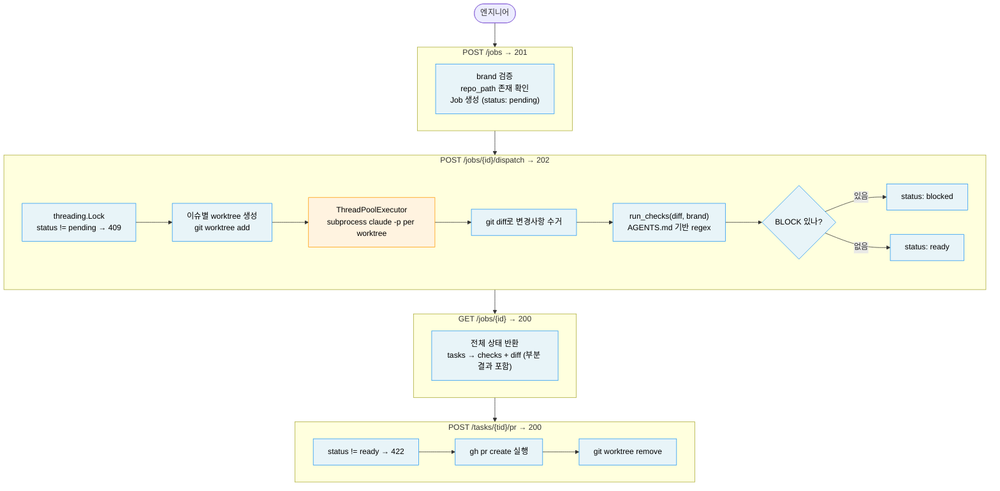

# case-04-orchestrator SPEC

> 이 문서는 설계 결정의 흔적이다. 구현 전에 읽고, 구현 중에 참고하고, 구현 후에 README와 교차 검증한다.

---

## §0 — API Contract (원문 고정, 변경 불가)

| Endpoint | Args | Result fields | 성공 코드 | 실패 케이스 |
|---|---|---|---|---|
| POST /jobs | title, issues: list[str], repo_path, brand | id, title, status, brand, trace_id, created_at | 201 | 422 (필드 누락) |
| POST /jobs/{id}/dispatch | (없음) | job_id, task_count, tasks: list[TaskOut] | 202 | 404 (job 없음), 409 (이미 dispatched) |
| GET /jobs/{id} | (없음) | Job full state: id, title, status, brand, trace_id, tasks | 200 | 404 |
| GET /jobs/{id}/tasks/{tid} | (없음) | Task: id, issue, status, worktree_path, diff, checks | 200 | 404 |
| POST /jobs/{id}/tasks/{tid}/pr | (없음) | pr_url, branch, worktree_path (삭제됨) | 200 | 404, 409 (이미 PR 있음), 422 (status != "ready") |

Task.status: `"queued"` → `"running"` → `"ready"` | `"blocked"` | `"failed"`

Job.status: `"pending"` → `"dispatched"` → `"done"` | `"partial_failure"`

Error response 형식 (RFC 7807):
```
{"detail": "<error_code>"}
```
error_code 목록: `job_not_found`, `already_dispatched`, `task_not_found`, `pr_already_exists`, `task_not_ready`

> SPEC의 다른 결정이 이 표와 충돌하면 이 표가 우선한다.
> Codex는 구현 전에 이 표를 읽고 필드명과 status code를 그대로 쓴다.

---

## §문제 정의

**WHO**: 이슈 5개를 아침에 던지고 오후에 PR 5개를 리뷰하고 싶은 엔지니어

**해결하는 불편**: 에이전트를 한 번에 하나씩밖에 못 돌림. 같은 working directory에서 여러 에이전트가 동시에 파일을 수정하면 충돌 나기 때문이다.

**LLM이 만들어서 결과가 매번 다른 부분**: 이슈별 Claude 코드 생성 (claude -p subprocess per worktree)

**외부 서비스 연결**: Anthropic API (claude CLI), git worktree, 파일시스템, GitHub CLI (gh pr create)

---

## §리스크

| 리스크 | 대응 방법 |
|---|---|
| claude -p subprocess가 블로킹 | ThreadPoolExecutor + run_in_executor로 event loop 비블로킹 |
| 같은 job에 dispatch 두 번 (race condition) | threading.Lock으로 status check + update를 atomic하게 처리 (§동시성 참조) |
| worktree 경로 충돌 | job_id 기반 worktree 이름 (`wt-{job_id[:8]}-{task_index}`) |
| gh CLI 없는 환경 | PR 생성 실패 시 branch 이름만 반환, 503 대신 422로 명확히 |
| 에이전트 timeout | subprocess timeout 5분 고정, 초과 시 task.status = "failed" |
| AGENTS.md 없는 worktree | 가드레일이 기본값 fallback으로 처리, reason에 "fallback" 명시 |

---

## §동시성 분석

**동시 요청이 안전한 케이스**: 엔지니어 여러 명이 각자 별개의 Job을 만들고 dispatch 하는 경우. Job이 분리되어 있으므로 store의 서로 다른 키를 건드린다. 간섭 없음.

**race condition이 발생하는 케이스**: 같은 job에 두 요청이 동시에 `POST /dispatch`를 보내는 경우.

문제 흐름:
```
요청 A: job.status == "pending" 확인 → True
요청 B: job.status == "pending" 확인 → True  (A가 아직 update 안 함)
요청 A: status = "dispatched", worktree 생성 시작
요청 B: status = "dispatched", worktree 생성 시작 → 중복 worktree, 중복 에이전트 실행
```

**해결 방법**: threading.Lock을 dispatch 핸들러에 적용. check + update를 atomic하게 묶는다.

```
lock 획득
  → job.status 확인
  → "pending"이 아니면 409 반환
  → status = "dispatched"로 업데이트
lock 해제
→ worktree 생성 + 에이전트 실행 (lock 밖에서 해야 performance 보장)
```

왜 이렇게 했냐면, lock을 에이전트 실행 전체에 걸면 병렬 dispatch의 이점이 사라진다. status 변경만 atomic하게 보호하면 충분하다.

**재고 조건**: 여러 서버 인스턴스를 띄우는 경우. in-memory lock은 같은 프로세스 안에서만 유효하다. 그때는 Redis 기반 distributed lock 또는 DB atomic update가 필요하다.

---

## §범위 (P0/P1/P2)

| 등급 | 범위 |
|---|---|
| P0 | 5개 엔드포인트 + threading.Lock dispatch + 가드레일 자동 체크 + pytest green |
| P1 | 실제 claude -p subprocess 실행, gh pr create 연동, worktree 삭제 |
| P2 | 인증, SQLite 영속성, OTEL trace export, KPI 측정 (PR per engineer), multi-brand AGENTS.md override, blocked task 재실행 엔드포인트 |

---

## §도메인 모델

```
Job 1—* Task 1—* GuardrailCheck
Task 1—1 AgentResult (optional, 에이전트 완료 후 생성)
```

- `Job`: 배치 단위. N개 이슈를 묶는다. brand와 repo_path를 가진다.
- `Task`: 이슈 하나 = worktree 하나 = 에이전트 실행 하나. 상태를 추적한다.
- `AgentResult`: 에이전트가 만든 결과물. diff와 변경된 파일 목록을 저장한다.
- `GuardrailCheck`: AGENTS.md 규칙 하나의 체크 결과. ruleId, severity, result, reason을 가진다.

---

## §설계 결정

### 결정 1 — 에이전트 실행 방식: `claude -p` subprocess

왜 이렇게 했냐면, 오케스트레이터의 가치는 worktree 스캐폴딩과 병렬 디스패치와 가드레일에 있다. 에이전트 루프를 직접 구현하면 오케스트레이터가 아니라 에이전트를 만드는 것이 된다. Claude Code는 이미 파일 읽기/쓰기/git 도구를 갖추고 있어서 다시 구현할 이유가 없다.

**전제 가정**: claude CLI가 설치된 환경에서만 실행된다. subprocess timeout 5분 내에 완료된다.

**가정 깨질 시나리오**: 복잡한 이슈에서 claude -p가 5분을 초과하는 경우.

**그때 다음 행동**: partial git diff 수거 시도 후 task.status = "failed". 재실행은 P2 엔드포인트 (`POST /tasks/{tid}/retry`).

**테스트 전략**: claude CLI 없는 CI 환경을 위해 subprocess.run을 mock으로 대체하는 fixture를 conftest.py에 둔다. mock은 미리 준비한 diff 텍스트를 stdout으로 반환한다.

### 결정 2 — 병렬성: ThreadPoolExecutor + run_in_executor

**후보 비교**:

| | 방식 | 장점 | 단점 |
|---|---|---|---|
| A | asyncio.create_subprocess_exec | native async, 스레드 오버헤드 없음 | stdout/stderr를 async stream으로 읽어야 해서 구현이 복잡해짐 |
| B | ThreadPoolExecutor + run_in_executor | subprocess.run이 단순하고 mock이 쉬움 | 스레드 N개 소비 |

**결정: B**. 왜 이렇게 했냐면, claude -p 결과를 스트리밍할 필요가 없다. 완료 후 git diff로 결과를 수거하면 충분하다. "fire and wait" 시맨틱에서는 subprocess.run + ThreadPoolExecutor가 더 단순하고 테스트가 쉽다.

**전제 가정**: 동시 task 수가 CPU 코어 수 범위 안에서 동작한다 (기본 max_workers=5).

**가정 깨질 시나리오**: 100개 이슈를 한 번에 dispatch하는 경우, 스레드 폭발.

**그때 다음 행동**: max_workers 환경변수로 노출, P2에서 Celery/asyncio queue로 전환.

### 결정 3 — 가드레일 시점: 자동 (dispatch flow에 포함)

왜 이렇게 했냐면, 에이전트가 만든 diff를 가드레일 없이 방치하는 상태가 필요 없다. 에이전트 완료 즉시 AGENTS.md 규칙을 체크해서 task status를 `"ready"` 또는 `"blocked"`로 확정한다.

**전제 가정**: 가드레일이 항상 같은 diff에 대해 같은 결과를 반환한다 (regex 기반이라 결정론적).

**가정 깨질 시나리오**: 가드레일이 없음 (해당 없음, regex는 항상 결정론적).

### 결정 4 — worktree 수명: 유지 후 명시적 PR 생성 시 삭제

왜 이렇게 했냐면, 가드레일이 통과해도 로직 오류가 있을 수 있다. 엔지니어가 직접 확인한 뒤 PR을 트리거해야 한다.

**전제 가정**: 엔지니어가 diff를 GET /tasks/{tid}로 조회하고 판단한 후 PR을 트리거한다.

**가정 깨질 시나리오**: 엔지니어가 PR 없이 작업을 포기하는 경우, worktree가 디스크에 쌓인다.

**그때 다음 행동**: P2 — DELETE /jobs/{id}/tasks/{tid}로 worktree 수동 삭제 엔드포인트 추가.

### 결정 5 — PR 트리거: 명시적

PR을 자동으로 올리면 검토하지 않은 코드가 PR로 쌓여서 노이즈가 된다. 엔지니어가 `POST /tasks/{tid}/pr`을 직접 호출해야 `gh pr create`가 실행된다.

**전제 가정**: `gh` CLI가 설치되어 있고 GitHub 인증이 되어있다.

**가정 깨질 시나리오**: gh CLI 없는 환경.

**그때 다음 행동**: branch 이름 반환으로 fallback. 에러 코드 `gh_cli_not_found`로 명확히 구분.

---

## §안 만들기로 한 것

| 항목 | 이유 |
|---|---|
| blocked task 재실행 엔드포인트 | P0 범위 초과. blocked된 경우 엔지니어가 직접 worktree에서 수정 후 새 job 생성. |
| blocked task worktree 자동 삭제 | 엔지니어가 코드를 직접 보고 수정할 수 있도록 유지. DELETE 엔드포인트는 P2. |
| task 부분 실패 시 전체 job 중단 | 각 task는 독립적으로 실행되고 실패 시 status만 "failed"로 기록. 다른 task에 영향 없음. |
| 스트리밍 진행 상황 | claude -p 실행 중 실시간 stdout 스트리밍 없음. 완료 후 diff 수거. SSE는 P2. |
| 인증 | YAGNI. bearer token 하드코딩도 없음. P2 — README에 extension path 명시. |

---

## §검증 가능성

**병렬 실행 시연**: dispatch 후 GET /jobs/{id}를 폴링하면 여러 task가 동시에 `"running"` 상태여야 한다. 순차 실행이면 한 번에 하나만 `"running"`.

**claude -p mock**: `conftest.py`의 autouse fixture가 subprocess.run을 mock으로 교체. mock은 `{"diff": "+print('hello')", "files": ["main.py"]}` 형태의 미리 준비된 응답을 반환.

**PASS 기준**:
```bash
uv run pytest -v           # 0 failed
uv run ruff check src/     # clean
POST /dispatch → 202
GET /jobs/{id} → tasks 중 최소 1개 status = "ready" 또는 "blocked"
POST /tasks/{tid}/pr (status="ready" task) → 200, pr_url 포함
POST /tasks/{tid}/pr (status="blocked" task) → 422, task_not_ready
POST /dispatch 두 번 → 두 번째는 409, already_dispatched
```

**E2E smoke test** (파일로 받아서 파싱):
```bash
curl -s -X POST localhost:8000/jobs \
  -H "Content-Type: application/json" \
  -d '{"title":"test","issues":["로그인 버그"],"repo_path":"/tmp/test-repo","brand":"efood"}' \
  -o /tmp/job.json
JOB=$(python3 -c "import json; print(json.load(open('/tmp/job.json'))['id'])")

curl -s -X POST localhost:8000/jobs/$JOB/dispatch -o /tmp/dispatch.json
curl -s localhost:8000/jobs/$JOB -o /tmp/state.json
python3 -m json.tool /tmp/state.json
```

---

## §아키텍처



파란 박스: 서비스가 직접 처리 (결과 예측 가능)
주황 박스: claude -p가 처리 (결과가 매번 다를 수 있음)

---

## §JD Signal Map

| JD 키워드 | 코드/README에서 보이는 곳 |
|---|---|
| `git worktrees` | POST /dispatch에서 worktree 생성, git log에 branch 이름 |
| `multi-agent` | ThreadPoolExecutor로 N개 에이전트 병렬 실행 |
| `AGENTS.md / Engineering Manifesto` | 가드레일이 {brand}/AGENTS.md를 그때그때 읽어서 severity 결정 |
| `guardrails — safe to deploy` | GuardrailCheck(ruleId, severity, result, reason), BLOCK이면 PR 차단 |
| `multi-brand` | Job.brand, 가드레일 로더가 brand로 파라미터화 |
| `context integration` | AGENTS.md가 각 worktree에 자동으로 존재 (claude -p가 읽음) |
| `OTEL / tracing` | trace_id on Job, P2 note for OAM export |
| `deterministic boundary` | claude -p가 코드 생성, 가드레일 regex가 결과 검증 |
| `developer productivity` | README §1: 순차 에이전트 실행 → 병렬 PR 생성 |
| `customizing agentic IDE` | claude -p를 AGENTS.md 컨텍스트와 함께 사내용으로 랩핑 |
| `measurement / KPI` | P2: PR per engineer, task 성공률 트래킹 |

---

## §5 Design Principles 적용

1. **SRP**: 엔드포인트 하나 = 상태 전환 하나. dispatch는 실행만, check는 자동, pr은 PR 생성만.
2. **Deterministic Boundary**: claude -p가 코드 생성 (비결정), 가드레일 regex가 결과 검증 (결정).
3. **YAGNI**: 인증, SQLite, retry loop 없음. P2로 README에만 언급.
4. **Workflow-first**: Job → dispatch → ready/blocked → pr 순서. 각 엔드포인트는 그 화살표 하나.
5. **Explainability**: GuardrailCheck.reason이 "per AGENTS.md R4" 형식으로 규칙을 인용.

---

## §LESSONS_LEARNED 적용

- Mistake 1: main.py에 `load_dotenv()` 첫 줄 필수
- Mistake 4: E2E curl은 파일로 받아서 파싱 (`-o /tmp/response.json`)
- Mistake 7: 가드레일이 AGENTS.md를 실제로 읽는지 리트머스 테스트 필수
